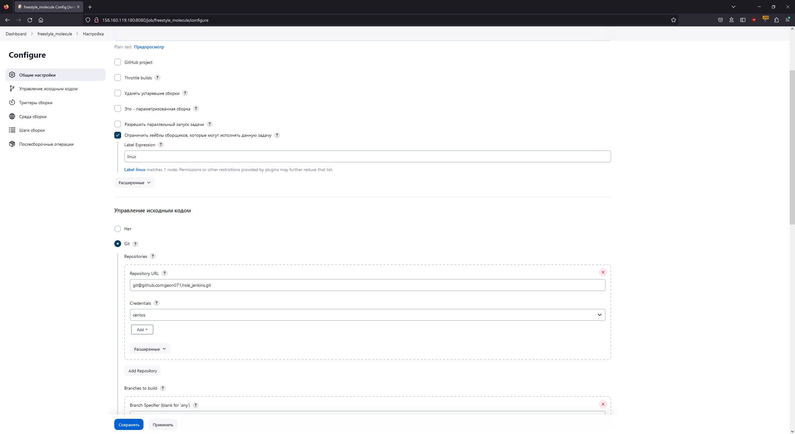
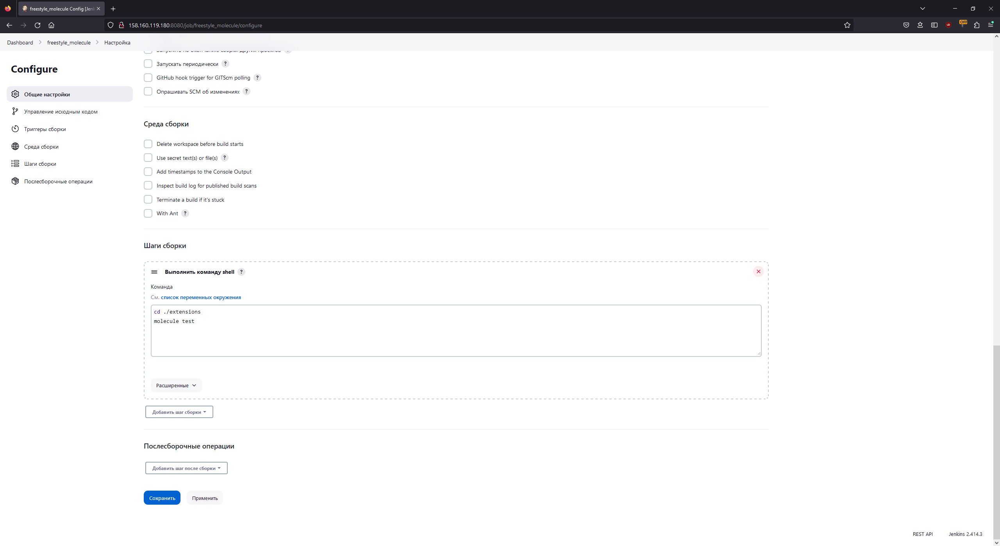
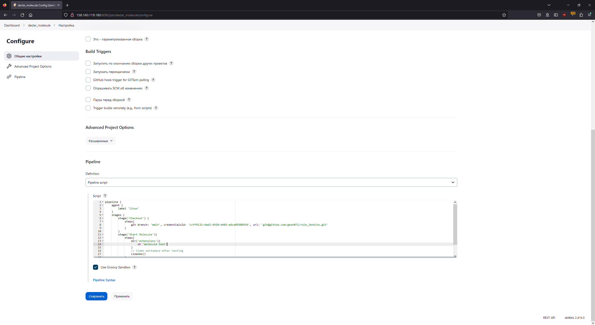
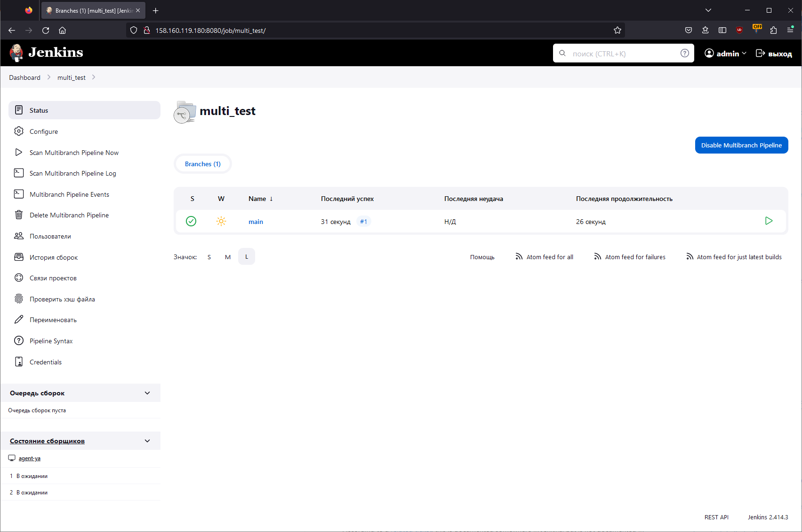
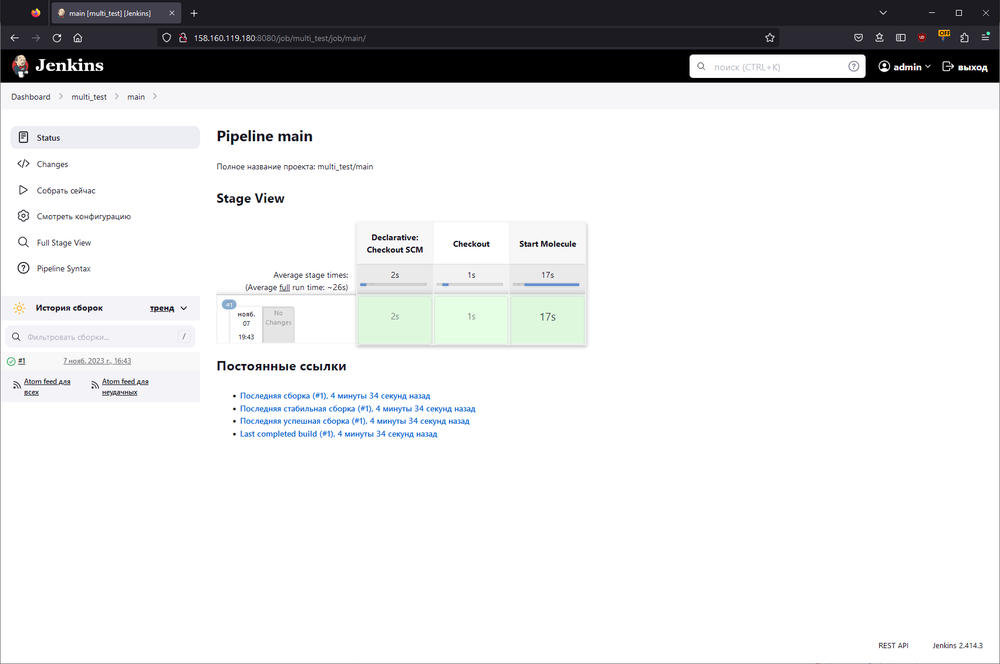
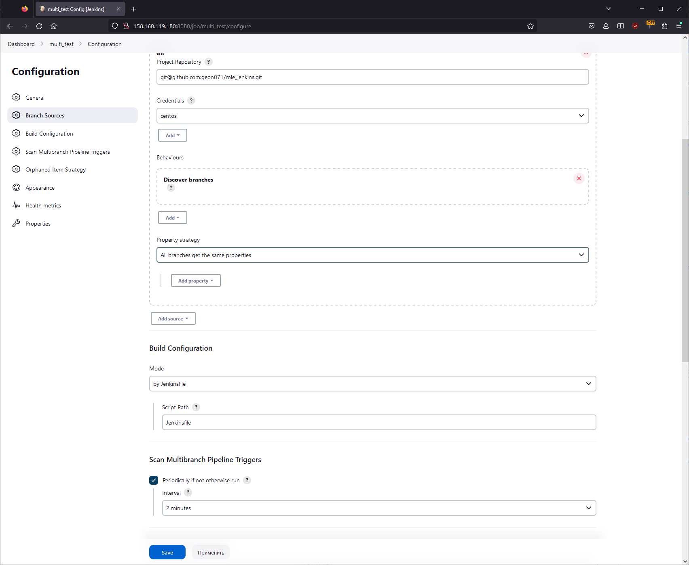
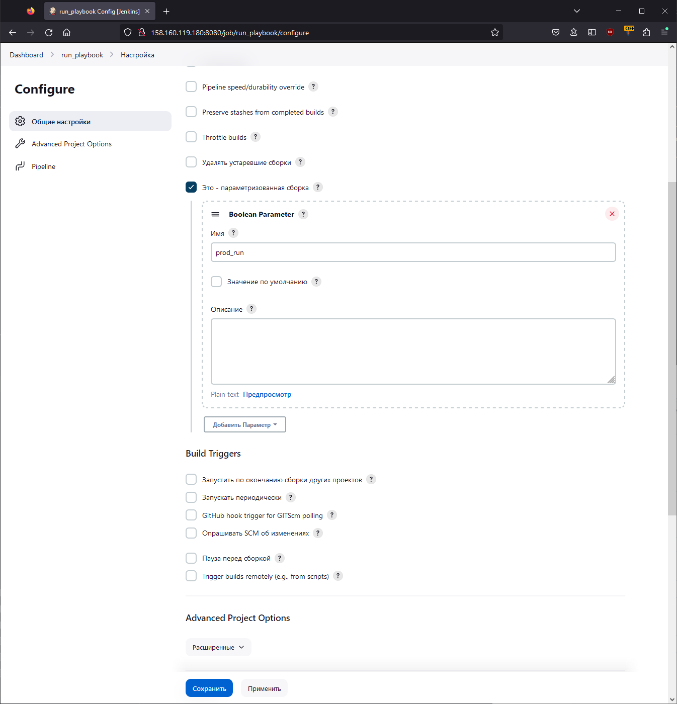
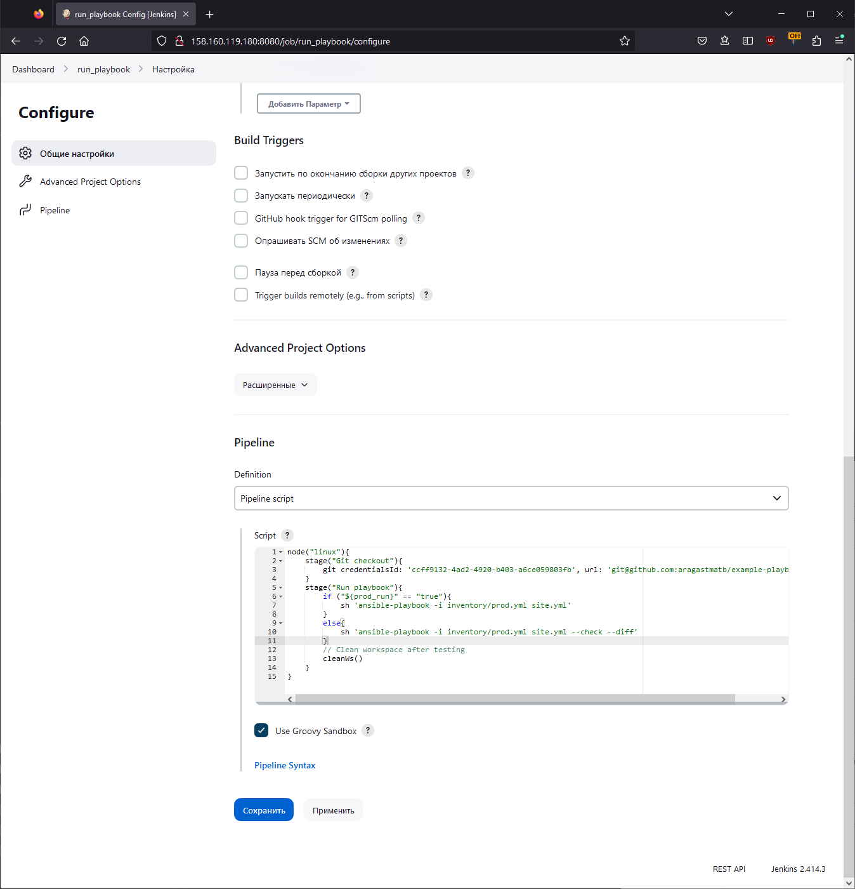

# Домашнее задание к занятию 10 «Jenkins»

## Основная часть

<details>
  <summary>Задание 1</summary>
1. Сделать Freestyle Job, который будет запускать `molecule test` из любого вашего репозитория с ролью.
</details>

### Ответ





<details>
  <summary>Лог джобы</summary>

```bash
Started by user admin
Running as SYSTEM
Building remotely on agent-ya (python3 linux docker) in workspace /opt/jenkins_agent/workspace/freestyle_molecule
The recommended git tool is: NONE
using credential ccff9132-4ad2-4920-b403-a6ce059803fb
 > git rev-parse --resolve-git-dir /opt/jenkins_agent/workspace/freestyle_molecule/.git # timeout=10
Fetching changes from the remote Git repository
 > git config remote.origin.url git@github.com:geon071/role_jenkins.git # timeout=10
Fetching upstream changes from git@github.com:geon071/role_jenkins.git
 > git --version # timeout=10
 > git --version # 'git version 1.8.3.1'
using GIT_SSH to set credentials 
[INFO] Currently running in a labeled security context
[INFO] Currently SELinux is 'enforcing' on the host
 > /usr/bin/chcon --type=ssh_home_t /opt/jenkins_agent/workspace/freestyle_molecule@tmp/jenkins-gitclient-ssh16959055550523266365.key
 > git fetch --tags --progress git@github.com:geon071/role_jenkins.git +refs/heads/*:refs/remotes/origin/* # timeout=10
 > git rev-parse refs/remotes/origin/main^{commit} # timeout=10
Checking out Revision d470de6a9de7aedd6270be8159c2ddc4b1674048 (refs/remotes/origin/main)
 > git config core.sparsecheckout # timeout=10
 > git checkout -f d470de6a9de7aedd6270be8159c2ddc4b1674048 # timeout=10
Commit message: "Reinit molecule scenario"
 > git rev-list --no-walk 6d0258277c4d1e505dd75b643b757ef90ac7ccd4 # timeout=10
[freestyle_molecule] $ /bin/sh -xe /tmp/jenkins16514639517049532748.sh
+ cd ./extensions
+ molecule test
/home/centos/.local/lib/python3.6/site-packages/ansible/parsing/vault/__init__.py:44: CryptographyDeprecationWarning: Python 3.6 is no longer supported by the Python core team. Therefore, support for it is deprecated in cryptography. The next release of cryptography will remove support for Python 3.6.
  from cryptography.exceptions import InvalidSignature
/home/centos/.local/lib/python3.6/site-packages/requests/__init__.py:104: RequestsDependencyWarning: urllib3 (1.26.18) or chardet (5.0.0)/charset_normalizer (2.0.12) doesn't match a supported version!
  RequestsDependencyWarning)
INFO     default scenario test matrix: dependency, lint, cleanup, destroy, syntax, create, prepare, converge, idempotence, side_effect, verify, cleanup, destroy
INFO     Performing prerun...
INFO     Set ANSIBLE_LIBRARY=/home/centos/.cache/ansible-compat/d2e41a/modules:/home/centos/.ansible/plugins/modules:/usr/share/ansible/plugins/modules
INFO     Set ANSIBLE_COLLECTIONS_PATH=/home/centos/.cache/ansible-compat/d2e41a/collections:/home/centos/.ansible/collections:/usr/share/ansible/collections
INFO     Set ANSIBLE_ROLES_PATH=/home/centos/.cache/ansible-compat/d2e41a/roles:/home/centos/.ansible/roles:/usr/share/ansible/roles:/etc/ansible/roles
INFO     Running default > dependency
WARNING  Skipping, missing the requirements file.
WARNING  Skipping, missing the requirements file.
INFO     Running default > lint
INFO     Lint is disabled.
INFO     Running default > cleanup
WARNING  Skipping, cleanup playbook not configured.
INFO     Running default > destroy
/home/centos/.local/lib/python3.6/site-packages/ansible/parsing/vault/__init__.py:44: CryptographyDeprecationWarning: Python 3.6 is no longer supported by the Python core team. Therefore, support for it is deprecated in cryptography. The next release of cryptography will remove support for Python 3.6.
  from cryptography.exceptions import InvalidSignature
[WARNING]: ansible.utils.display.initialize_locale has not been called, this
may result in incorrectly calculated text widths that can cause Display to
print incorrect line lengths

PLAY [Destroy] *****************************************************************

TASK [Populate instance config] ************************************************
ok: [localhost]

TASK [Dump instance config] ****************************************************
skipping: [localhost]

PLAY RECAP *********************************************************************
localhost                  : ok=1    changed=0    unreachable=0    failed=0    skipped=1    rescued=0    ignored=0

INFO     Running default > syntax

playbook: /opt/jenkins_agent/workspace/freestyle_molecule/extensions/molecule/default/converge.yml
/home/centos/.local/lib/python3.6/site-packages/ansible/parsing/vault/__init__.py:44: CryptographyDeprecationWarning: Python 3.6 is no longer supported by the Python core team. Therefore, support for it is deprecated in cryptography. The next release of cryptography will remove support for Python 3.6.
  from cryptography.exceptions import InvalidSignature
INFO     Running default > create
/home/centos/.local/lib/python3.6/site-packages/ansible/parsing/vault/__init__.py:44: CryptographyDeprecationWarning: Python 3.6 is no longer supported by the Python core team. Therefore, support for it is deprecated in cryptography. The next release of cryptography will remove support for Python 3.6.
  from cryptography.exceptions import InvalidSignature
[WARNING]: ansible.utils.display.initialize_locale has not been called, this
may result in incorrectly calculated text widths that can cause Display to
print incorrect line lengths

PLAY [Create] ******************************************************************

TASK [Populate instance config dict] *******************************************
skipping: [localhost]

TASK [Convert instance config dict to a list] **********************************
skipping: [localhost]

TASK [Dump instance config] ****************************************************
skipping: [localhost]

PLAY RECAP *********************************************************************
localhost                  : ok=0    changed=0    unreachable=0    failed=0    skipped=3    rescued=0    ignored=0

INFO     Running default > prepare
WARNING  Skipping, prepare playbook not configured.
INFO     Running default > converge
/home/centos/.local/lib/python3.6/site-packages/ansible/parsing/vault/__init__.py:44: CryptographyDeprecationWarning: Python 3.6 is no longer supported by the Python core team. Therefore, support for it is deprecated in cryptography. The next release of cryptography will remove support for Python 3.6.
  from cryptography.exceptions import InvalidSignature
[WARNING]: ansible.utils.display.initialize_locale has not been called, this
may result in incorrectly calculated text widths that can cause Display to
print incorrect line lengths

PLAY [Converge] ****************************************************************

TASK [Include extensions] ******************************************************

PLAY RECAP *********************************************************************

INFO     Running default > idempotence
/home/centos/.local/lib/python3.6/site-packages/ansible/parsing/vault/__init__.py:44: CryptographyDeprecationWarning: Python 3.6 is no longer supported by the Python core team. Therefore, support for it is deprecated in cryptography. The next release of cryptography will remove support for Python 3.6.
  from cryptography.exceptions import InvalidSignature
[WARNING]: ansible.utils.display.initialize_locale has not been called, this
may result in incorrectly calculated text widths that can cause Display to
print incorrect line lengths

PLAY [Converge] ****************************************************************

TASK [Include extensions] ******************************************************

PLAY RECAP *********************************************************************

INFO     Idempotence completed successfully.
INFO     Running default > side_effect
WARNING  Skipping, side effect playbook not configured.
INFO     Running default > verify
INFO     Running Ansible Verifier
/home/centos/.local/lib/python3.6/site-packages/ansible/parsing/vault/__init__.py:44: CryptographyDeprecationWarning: Python 3.6 is no longer supported by the Python core team. Therefore, support for it is deprecated in cryptography. The next release of cryptography will remove support for Python 3.6.
  from cryptography.exceptions import InvalidSignature
[WARNING]: ansible.utils.display.initialize_locale has not been called, this
may result in incorrectly calculated text widths that can cause Display to
print incorrect line lengths

PLAY [Verify] ******************************************************************

TASK [Example assertion] *******************************************************
ok: [instance] => {
    "changed": false,
    "msg": "All assertions passed"
}

PLAY RECAP *********************************************************************
instance                   : ok=1    changed=0    unreachable=0    failed=0    skipped=0    rescued=0    ignored=0

INFO     Verifier completed successfully.
INFO     Running default > cleanup
WARNING  Skipping, cleanup playbook not configured.
INFO     Running default > destroy
/home/centos/.local/lib/python3.6/site-packages/ansible/parsing/vault/__init__.py:44: CryptographyDeprecationWarning: Python 3.6 is no longer supported by the Python core team. Therefore, support for it is deprecated in cryptography. The next release of cryptography will remove support for Python 3.6.
  from cryptography.exceptions import InvalidSignature
[WARNING]: ansible.utils.display.initialize_locale has not been called, this
may result in incorrectly calculated text widths that can cause Display to
print incorrect line lengths

PLAY [Destroy] *****************************************************************

TASK [Populate instance config] ************************************************
ok: [localhost]

TASK [Dump instance config] ****************************************************
skipping: [localhost]

PLAY RECAP *********************************************************************
localhost                  : ok=1    changed=0    unreachable=0    failed=0    skipped=1    rescued=0    ignored=0

INFO     Pruning extra files from scenario ephemeral directory
Finished: SUCCESS
```

</details>

<details>
  <summary>Задание 2</summary>
2. Сделать Declarative Pipeline Job, который будет запускать `molecule test` из любого вашего репозитория с ролью.
</details>

### Ответ



<details>
  <summary>Лог джобы</summary>

```bash
Started by user admin
[Pipeline] Start of Pipeline
[Pipeline] node
Running on agent-ya in /opt/jenkins_agent/workspace/declar_molecule
[Pipeline] {
[Pipeline] stage
[Pipeline] { (Checkout)
[Pipeline] git
The recommended git tool is: NONE
using credential ccff9132-4ad2-4920-b403-a6ce059803fb
Fetching changes from the remote Git repository
 > git rev-parse --resolve-git-dir /opt/jenkins_agent/workspace/declar_molecule/.git # timeout=10
 > git config remote.origin.url git@github.com:geon071/role_jenkins.git # timeout=10
Fetching upstream changes from git@github.com:geon071/role_jenkins.git
 > git --version # timeout=10
 > git --version # 'git version 1.8.3.1'
using GIT_SSH to set credentials 
[INFO] Currently running in a labeled security context
[INFO] Currently SELinux is 'enforcing' on the host
 > /usr/bin/chcon --type=ssh_home_t /opt/jenkins_agent/workspace/declar_molecule@tmp/jenkins-gitclient-ssh10666919032163757891.key
 > git fetch --tags --progress git@github.com:geon071/role_jenkins.git +refs/heads/*:refs/remotes/origin/* # timeout=10
Checking out Revision d470de6a9de7aedd6270be8159c2ddc4b1674048 (refs/remotes/origin/main)
Commit message: "Reinit molecule scenario"
 > git rev-parse refs/remotes/origin/main^{commit} # timeout=10
 > git config core.sparsecheckout # timeout=10
 > git checkout -f d470de6a9de7aedd6270be8159c2ddc4b1674048 # timeout=10
 > git branch -a -v --no-abbrev # timeout=10
 > git branch -D main # timeout=10
 > git checkout -b main d470de6a9de7aedd6270be8159c2ddc4b1674048 # timeout=10
 > git rev-list --no-walk d470de6a9de7aedd6270be8159c2ddc4b1674048 # timeout=10
[Pipeline] }
[Pipeline] // stage
[Pipeline] stage
[Pipeline] { (Start Molecule)
[Pipeline] dir
Running in /opt/jenkins_agent/workspace/declar_molecule/extensions
[Pipeline] {
[Pipeline] sh
+ molecule test
/home/centos/.local/lib/python3.6/site-packages/ansible/parsing/vault/__init__.py:44: CryptographyDeprecationWarning: Python 3.6 is no longer supported by the Python core team. Therefore, support for it is deprecated in cryptography. The next release of cryptography will remove support for Python 3.6.
  from cryptography.exceptions import InvalidSignature
/home/centos/.local/lib/python3.6/site-packages/requests/__init__.py:104: RequestsDependencyWarning: urllib3 (1.26.18) or chardet (5.0.0)/charset_normalizer (2.0.12) doesn't match a supported version!
  RequestsDependencyWarning)
INFO     default scenario test matrix: dependency, lint, cleanup, destroy, syntax, create, prepare, converge, idempotence, side_effect, verify, cleanup, destroy
INFO     Performing prerun...
INFO     Set ANSIBLE_LIBRARY=/home/centos/.cache/ansible-compat/2ddd6b/modules:/home/centos/.ansible/plugins/modules:/usr/share/ansible/plugins/modules
INFO     Set ANSIBLE_COLLECTIONS_PATH=/home/centos/.cache/ansible-compat/2ddd6b/collections:/home/centos/.ansible/collections:/usr/share/ansible/collections
INFO     Set ANSIBLE_ROLES_PATH=/home/centos/.cache/ansible-compat/2ddd6b/roles:/home/centos/.ansible/roles:/usr/share/ansible/roles:/etc/ansible/roles
INFO     Running default > dependency
WARNING  Skipping, missing the requirements file.
WARNING  Skipping, missing the requirements file.
INFO     Running default > lint
INFO     Lint is disabled.
INFO     Running default > cleanup
WARNING  Skipping, cleanup playbook not configured.
INFO     Running default > destroy
[DEPRECATION WARNING]: Ansible will require Python 3.8 or newer on the
controller starting with Ansible 2.12. Current version: 3.6.8 (default, Jun 20
2023, 11:53:23) [GCC 4.8.5 20150623 (Red Hat 4.8.5-44)]. This feature will be
removed from ansible-core in version 2.12. Deprecation warnings can be disabled
 by setting deprecation_warnings=False in ansible.cfg.

PLAY [Destroy] *****************************************************************

TASK [Populate instance config] ************************************************
/home/centos/.local/lib/python3.6/site-packages/ansible/parsing/vault/__init__.py:44: CryptographyDeprecationWarning: Python 3.6 is no longer supported by the Python core team. Therefore, support for it is deprecated in cryptography. The next release of cryptography will remove support for Python 3.6.
  from cryptography.exceptions import InvalidSignature
ok: [localhost]

TASK [Dump instance config] ****************************************************
skipping: [localhost]

PLAY RECAP *********************************************************************
localhost                  : ok=1    changed=0    unreachable=0    failed=0    skipped=1    rescued=0    ignored=0

INFO     Running default > syntax
[DEPRECATION WARNING]: Ansible will require Python 3.8 or newer on the
controller starting with Ansible 2.12. Current version: 3.6.8 (default, Jun 20
2023, 11:53:23) [GCC 4.8.5 20150623 (Red Hat 4.8.5-44)]. This feature will be
removed from ansible-core in version 2.12. Deprecation warnings can be disabled
 by setting deprecation_warnings=False in ansible.cfg.

playbook: /opt/jenkins_agent/workspace/declar_molecule/extensions/molecule/default/converge.yml
/home/centos/.local/lib/python3.6/site-packages/ansible/parsing/vault/__init__.py:44: CryptographyDeprecationWarning: Python 3.6 is no longer supported by the Python core team. Therefore, support for it is deprecated in cryptography. The next release of cryptography will remove support for Python 3.6.
  from cryptography.exceptions import InvalidSignature
INFO     Running default > create
[DEPRECATION WARNING]: Ansible will require Python 3.8 or newer on the
controller starting with Ansible 2.12. Current version: 3.6.8 (default, Jun 20
2023, 11:53:23) [GCC 4.8.5 20150623 (Red Hat 4.8.5-44)]. This feature will be
removed from ansible-core in version 2.12. Deprecation warnings can be disabled
 by setting deprecation_warnings=False in ansible.cfg.

PLAY [Create] ******************************************************************

TASK [Populate instance config dict] *******************************************
/home/centos/.local/lib/python3.6/site-packages/ansible/parsing/vault/__init__.py:44: CryptographyDeprecationWarning: Python 3.6 is no longer supported by the Python core team. Therefore, support for it is deprecated in cryptography. The next release of cryptography will remove support for Python 3.6.
  from cryptography.exceptions import InvalidSignature
skipping: [localhost]

TASK [Convert instance config dict to a list] **********************************
skipping: [localhost]

TASK [Dump instance config] ****************************************************
skipping: [localhost]

PLAY RECAP *********************************************************************
localhost                  : ok=0    changed=0    unreachable=0    failed=0    skipped=3    rescued=0    ignored=0

INFO     Running default > prepare
WARNING  Skipping, prepare playbook not configured.
INFO     Running default > converge
[DEPRECATION WARNING]: Ansible will require Python 3.8 or newer on the
controller starting with Ansible 2.12. Current version: 3.6.8 (default, Jun 20
2023, 11:53:23) [GCC 4.8.5 20150623 (Red Hat 4.8.5-44)]. This feature will be
removed from ansible-core in version 2.12. Deprecation warnings can be disabled
 by setting deprecation_warnings=False in ansible.cfg.

PLAY [Converge] ****************************************************************

TASK [Include extensions] ******************************************************
/home/centos/.local/lib/python3.6/site-packages/ansible/parsing/vault/__init__.py:44: CryptographyDeprecationWarning: Python 3.6 is no longer supported by the Python core team. Therefore, support for it is deprecated in cryptography. The next release of cryptography will remove support for Python 3.6.
  from cryptography.exceptions import InvalidSignature

PLAY RECAP *********************************************************************

INFO     Running default > idempotence
[DEPRECATION WARNING]: Ansible will require Python 3.8 or newer on the
controller starting with Ansible 2.12. Current version: 3.6.8 (default, Jun 20
2023, 11:53:23) [GCC 4.8.5 20150623 (Red Hat 4.8.5-44)]. This feature will be
removed from ansible-core in version 2.12. Deprecation warnings can be disabled
 by setting deprecation_warnings=False in ansible.cfg.

PLAY [Converge] ****************************************************************

TASK [Include extensions] ******************************************************
/home/centos/.local/lib/python3.6/site-packages/ansible/parsing/vault/__init__.py:44: CryptographyDeprecationWarning: Python 3.6 is no longer supported by the Python core team. Therefore, support for it is deprecated in cryptography. The next release of cryptography will remove support for Python 3.6.
  from cryptography.exceptions import InvalidSignature

PLAY RECAP *********************************************************************

INFO     Idempotence completed successfully.
INFO     Running default > side_effect
WARNING  Skipping, side effect playbook not configured.
INFO     Running default > verify
INFO     Running Ansible Verifier
[DEPRECATION WARNING]: Ansible will require Python 3.8 or newer on the
controller starting with Ansible 2.12. Current version: 3.6.8 (default, Jun 20
2023, 11:53:23) [GCC 4.8.5 20150623 (Red Hat 4.8.5-44)]. This feature will be
removed from ansible-core in version 2.12. Deprecation warnings can be disabled
 by setting deprecation_warnings=False in ansible.cfg.

PLAY [Verify] ******************************************************************

TASK [Example assertion] *******************************************************
/home/centos/.local/lib/python3.6/site-packages/ansible/parsing/vault/__init__.py:44: CryptographyDeprecationWarning: Python 3.6 is no longer supported by the Python core team. Therefore, support for it is deprecated in cryptography. The next release of cryptography will remove support for Python 3.6.
  from cryptography.exceptions import InvalidSignature
ok: [instance] => {
    "changed": false,
    "msg": "All assertions passed"
}

PLAY RECAP *********************************************************************
instance                   : ok=1    changed=0    unreachable=0    failed=0    skipped=0    rescued=0    ignored=0

INFO     Verifier completed successfully.
INFO     Running default > cleanup
WARNING  Skipping, cleanup playbook not configured.
INFO     Running default > destroy
[DEPRECATION WARNING]: Ansible will require Python 3.8 or newer on the
controller starting with Ansible 2.12. Current version: 3.6.8 (default, Jun 20
2023, 11:53:23) [GCC 4.8.5 20150623 (Red Hat 4.8.5-44)]. This feature will be
removed from ansible-core in version 2.12. Deprecation warnings can be disabled
 by setting deprecation_warnings=False in ansible.cfg.

PLAY [Destroy] *****************************************************************

TASK [Populate instance config] ************************************************
/home/centos/.local/lib/python3.6/site-packages/ansible/parsing/vault/__init__.py:44: CryptographyDeprecationWarning: Python 3.6 is no longer supported by the Python core team. Therefore, support for it is deprecated in cryptography. The next release of cryptography will remove support for Python 3.6.
  from cryptography.exceptions import InvalidSignature
ok: [localhost]

TASK [Dump instance config] ****************************************************
skipping: [localhost]

PLAY RECAP *********************************************************************
localhost                  : ok=1    changed=0    unreachable=0    failed=0    skipped=1    rescued=0    ignored=0

INFO     Pruning extra files from scenario ephemeral directory
[Pipeline] }
[Pipeline] // dir
[Pipeline] cleanWs
[WS-CLEANUP] Deleting project workspace...
[WS-CLEANUP] Deferred wipeout is used...
[WS-CLEANUP] done
[Pipeline] }
[Pipeline] // stage
[Pipeline] }
[Pipeline] // node
[Pipeline] End of Pipeline
Finished: SUCCESS
```

</details>

<details>
  <summary>Задание 3, 4</summary>
3. Перенести Declarative Pipeline в репозиторий в файл `Jenkinsfile`.
4. Создать Multibranch Pipeline на запуск `Jenkinsfile` из репозитория.
</details>

### Ответ

Перенес в репозитрий - <a>https://github.com/geon071/role_jenkins/blob/main/Jenkinsfile</a>







<details>
  <summary>Лог сканирования</summary>

```bash
Started by timer
[Tue Nov 07 16:46:05 UTC 2023] Starting branch indexing...
 > git --version # timeout=10
 > git --version # 'git version 1.8.3.1'
using GIT_SSH to set credentials 
[INFO] Currently running in a labeled security context
[INFO] Currently SELinux is 'enforcing' on the host
 > /usr/bin/chcon --type=ssh_home_t /tmp/jenkins-gitclient-ssh5217212607860704300.key
 > git ls-remote git@github.com:geon071/role_jenkins.git # timeout=10
 > git rev-parse --resolve-git-dir /var/lib/jenkins/caches/git-afbfb7e6e1c250c3c665c3377b1a1421/.git # timeout=10
Setting origin to git@github.com:geon071/role_jenkins.git
 > git config remote.origin.url git@github.com:geon071/role_jenkins.git # timeout=10
Fetching & pruning origin...
Listing remote references...
 > git config --get remote.origin.url # timeout=10
 > git --version # timeout=10
 > git --version # 'git version 1.8.3.1'
using GIT_SSH to set credentials 
[INFO] Currently running in a labeled security context
[INFO] Currently SELinux is 'enforcing' on the host
 > /usr/bin/chcon --type=ssh_home_t /var/lib/jenkins/caches/git-afbfb7e6e1c250c3c665c3377b1a1421@tmp/jenkins-gitclient-ssh1432586673827474890.key
 > git ls-remote -h git@github.com:geon071/role_jenkins.git # timeout=10
Fetching upstream changes from origin
 > git config --get remote.origin.url # timeout=10
using GIT_SSH to set credentials 
[INFO] Currently running in a labeled security context
[INFO] Currently SELinux is 'enforcing' on the host
 > /usr/bin/chcon --type=ssh_home_t /var/lib/jenkins/caches/git-afbfb7e6e1c250c3c665c3377b1a1421@tmp/jenkins-gitclient-ssh7809670909927158094.key
 > git fetch --tags --progress --prune origin +refs/heads/*:refs/remotes/origin/* # timeout=10
Checking branches...
  Checking branch main
      ‘Jenkinsfile’ found
    Met criteria
No changes detected: main (still at 2db32ca9ae5074aed2573a0b2e20df4c6e61aeba)
Processed 1 branches
[Tue Nov 07 16:46:09 UTC 2023] Finished branch indexing. Indexing took 4.1 sec
Finished: SUCCESS
```

</details>

<details>
  <summary>Задание 5, 6, 7</summary>
5. Создать Scripted Pipeline, наполнить его скриптом из [pipeline](./pipeline).
6. Внести необходимые изменения, чтобы Pipeline запускал `ansible-playbook` без флагов `--check --diff`, если не установлен параметр при запуске джобы (prod_run = True). По умолчанию параметр имеет значение False и запускает прогон с флагами `--check --diff`.
7. Проверить работоспособность, исправить ошибки, исправленный Pipeline вложить в репозиторий в файл `ScriptedJenkinsfile`.
</details>

### Ответ





<details>
  <summary>Лог prod_run false</summary>

```bash
Started by user admin
[Pipeline] Start of Pipeline
[Pipeline] node
Running on agent-ya in /opt/jenkins_agent/workspace/run_playbook
[Pipeline] {
[Pipeline] stage
[Pipeline] { (Git checkout)
[Pipeline] git
The recommended git tool is: NONE
using credential ccff9132-4ad2-4920-b403-a6ce059803fb
Cloning the remote Git repository
Cloning repository git@github.com:aragastmatb/example-playbook.git
 > git init /opt/jenkins_agent/workspace/run_playbook # timeout=10
Fetching upstream changes from git@github.com:aragastmatb/example-playbook.git
 > git --version # timeout=10
 > git --version # 'git version 1.8.3.1'
using GIT_SSH to set credentials 
[INFO] Currently running in a labeled security context
[INFO] Currently SELinux is 'enforcing' on the host
 > /usr/bin/chcon --type=ssh_home_t /opt/jenkins_agent/workspace/run_playbook@tmp/jenkins-gitclient-ssh15910889707158491841.key
 > git fetch --tags --progress git@github.com:aragastmatb/example-playbook.git +refs/heads/*:refs/remotes/origin/* # timeout=10
Avoid second fetch
Checking out Revision 20bd8d945340bb742acdd9e8c1a8fb5b73cc1700 (refs/remotes/origin/master)
Commit message: "Merge branch 'master' of https://github.com/aragastmatb/example-playbook"
First time build. Skipping changelog.
[Pipeline] }
[Pipeline] // stage
 > git config remote.origin.url git@github.com:aragastmatb/example-playbook.git # timeout=10
 > git config --add remote.origin.fetch +refs/heads/*:refs/remotes/origin/* # timeout=10
 > git rev-parse refs/remotes/origin/master^{commit} # timeout=10
 > git config core.sparsecheckout # timeout=10
 > git checkout -f 20bd8d945340bb742acdd9e8c1a8fb5b73cc1700 # timeout=10
 > git branch -a -v --no-abbrev # timeout=10
 > git checkout -b master 20bd8d945340bb742acdd9e8c1a8fb5b73cc1700 # timeout=10
[Pipeline] stage
[Pipeline] { (Run playbook)
[Pipeline] sh
+ ansible-playbook -i inventory/prod.yml site.yml --check --diff
[DEPRECATION WARNING]: Ansible will require Python 3.8 or newer on the 
controller starting with Ansible 2.12. Current version: 3.6.8 (default, Jun 20 
2023, 11:53:23) [GCC 4.8.5 20150623 (Red Hat 4.8.5-44)]. This feature will be 
removed from ansible-core in version 2.12. Deprecation warnings can be disabled
 by setting deprecation_warnings=False in ansible.cfg.

PLAY [Install Java] ************************************************************

TASK [Gathering Facts] *********************************************************
/home/centos/.local/lib/python3.6/site-packages/ansible/parsing/vault/__init__.py:44: CryptographyDeprecationWarning: Python 3.6 is no longer supported by the Python core team. Therefore, support for it is deprecated in cryptography. The next release of cryptography will remove support for Python 3.6.
  from cryptography.exceptions import InvalidSignature
ok: [localhost]

TASK [java : Upload .tar.gz file containing binaries from local storage] *******
skipping: [localhost]

TASK [java : Upload .tar.gz file conaining binaries from remote storage] *******
changed: [localhost]

TASK [java : Ensure installation dir exists] ***********************************
--- before
+++ after
@@ -1,4 +1,4 @@
 {
     "path": "/opt/jdk/openjdk-11",
-    "state": "absent"
+    "state": "directory"
 }

changed: [localhost]

TASK [java : Extract java in the installation directory] ***********************
An exception occurred during task execution. To see the full traceback, use -vvv. The error was: NoneType: None
fatal: [localhost]: FAILED! => {"changed": false, "msg": "dest '/opt/jdk/openjdk-11' must be an existing dir"}

PLAY RECAP *********************************************************************
localhost                  : ok=3    changed=2    unreachable=0    failed=1    skipped=1    rescued=0    ignored=0   

[Pipeline] }
[Pipeline] // stage
[Pipeline] }
[Pipeline] // node
[Pipeline] End of Pipeline
ERROR: script returned exit code 2
Finished: FAILURE
```

</details>

<details>
  <summary>Лог prod_run true</summary>

```bash
Started by user admin
[Pipeline] Start of Pipeline
[Pipeline] node
Running on agent-ya in /opt/jenkins_agent/workspace/run_playbook
[Pipeline] {
[Pipeline] stage
[Pipeline] { (Git checkout)
[Pipeline] git
The recommended git tool is: NONE
using credential ccff9132-4ad2-4920-b403-a6ce059803fb
Fetching changes from the remote Git repository
 > git rev-parse --resolve-git-dir /opt/jenkins_agent/workspace/run_playbook/.git # timeout=10
 > git config remote.origin.url git@github.com:aragastmatb/example-playbook.git # timeout=10
Fetching upstream changes from git@github.com:aragastmatb/example-playbook.git
 > git --version # timeout=10
 > git --version # 'git version 1.8.3.1'
using GIT_SSH to set credentials 
[INFO] Currently running in a labeled security context
[INFO] Currently SELinux is 'enforcing' on the host
 > /usr/bin/chcon --type=ssh_home_t /opt/jenkins_agent/workspace/run_playbook@tmp/jenkins-gitclient-ssh14753650559050471691.key
 > git fetch --tags --progress git@github.com:aragastmatb/example-playbook.git +refs/heads/*:refs/remotes/origin/* # timeout=10
Checking out Revision 20bd8d945340bb742acdd9e8c1a8fb5b73cc1700 (refs/remotes/origin/master)
Commit message: "Merge branch 'master' of https://github.com/aragastmatb/example-playbook"
 > git rev-parse refs/remotes/origin/master^{commit} # timeout=10
 > git config core.sparsecheckout # timeout=10
 > git checkout -f 20bd8d945340bb742acdd9e8c1a8fb5b73cc1700 # timeout=10
 > git branch -a -v --no-abbrev # timeout=10
 > git branch -D master # timeout=10
 > git checkout -b master 20bd8d945340bb742acdd9e8c1a8fb5b73cc1700 # timeout=10
 > git rev-list --no-walk 20bd8d945340bb742acdd9e8c1a8fb5b73cc1700 # timeout=10
[Pipeline] }
[Pipeline] // stage
[Pipeline] stage
[Pipeline] { (Run playbook)
[Pipeline] sh
+ ansible-playbook -i inventory/prod.yml site.yml
[DEPRECATION WARNING]: Ansible will require Python 3.8 or newer on the 
controller starting with Ansible 2.12. Current version: 3.6.8 (default, Jun 20 
2023, 11:53:23) [GCC 4.8.5 20150623 (Red Hat 4.8.5-44)]. This feature will be 
removed from ansible-core in version 2.12. Deprecation warnings can be disabled
 by setting deprecation_warnings=False in ansible.cfg.

PLAY [Install Java] ************************************************************

TASK [Gathering Facts] *********************************************************
/home/centos/.local/lib/python3.6/site-packages/ansible/parsing/vault/__init__.py:44: CryptographyDeprecationWarning: Python 3.6 is no longer supported by the Python core team. Therefore, support for it is deprecated in cryptography. The next release of cryptography will remove support for Python 3.6.
  from cryptography.exceptions import InvalidSignature
ok: [localhost]

TASK [java : Upload .tar.gz file containing binaries from local storage] *******
skipping: [localhost]

TASK [java : Upload .tar.gz file conaining binaries from remote storage] *******
changed: [localhost]

TASK [java : Ensure installation dir exists] ***********************************
changed: [localhost]

TASK [java : Extract java in the installation directory] ***********************
changed: [localhost]

TASK [java : Export environment variables] *************************************
changed: [localhost]

PLAY RECAP *********************************************************************
localhost                  : ok=5    changed=4    unreachable=0    failed=0    skipped=1    rescued=0    ignored=0   

[Pipeline] cleanWs
[WS-CLEANUP] Deleting project workspace...
[WS-CLEANUP] Deferred wipeout is used...
[WS-CLEANUP] done
[Pipeline] }
[Pipeline] // stage
[Pipeline] }
[Pipeline] // node
[Pipeline] End of Pipeline
Finished: SUCCESS
```

</details>

#### Ссылки

[Репозиторий с ролью](https://github.com/geon071/role_jenkins/tree/main)

[Отредактированный файл ScriptedJenkinsfile](https://github.com/geon071/net_virt3/blob/main/09-ci-04-jenkins/ScriptedJenkinsfile)