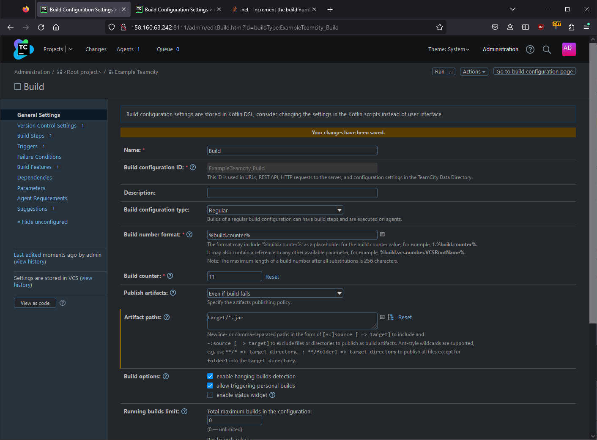

# Домашнее задание к занятию 11 «Teamcity»

## Основная часть

1. Создайте новый проект в teamcity на основе fork.
2. Сделайте autodetect конфигурации.


3. Сохраните необходимые шаги, запустите первую сборку master.


4. Поменяйте условия сборки: если сборка по ветке `master`, то должен происходит `mvn clean deploy`, иначе `mvn clean test`.


5. Для deploy будет необходимо загрузить [settings.xml](./teamcity/settings.xml) в набор конфигураций maven у teamcity, предварительно записав туда креды для подключения к nexus.


6. В pom.xml необходимо поменять ссылки на репозиторий и nexus.
7. Запустите сборку по master, убедитесь, что всё прошло успешно и артефакт появился в nexus.


8. Мигрируйте `build configuration` в репозиторий.


9. Создайте отдельную ветку `feature/add_reply` в репозитории.
10. Напишите новый метод для класса Welcomer: метод должен возвращать произвольную реплику, содержащую слово `hunter`.

```java
 public String welcomerSaysNewHunter(){
  return "How you doing, hunter?";
 }
```

11. Дополните тест для нового метода на поиск слова `hunter` в новой реплике.

```java
 @Test
 public void welcomerSaysHunter(){
  assertThat(welcomer.sayHunter(), containsString("hunter"));
 }
```

12. Сделайте push всех изменений в новую ветку репозитория.
13. Убедитесь, что сборка самостоятельно запустилась, тесты прошли успешно.

Запустилось, по событию commit, но упал с ошибкой выкладки в nexus, потому что версия 0.0.2 там уже есть. Поднял версию через еще один коммит


14. Внесите изменения из произвольной ветки `feature/add_reply` в `master` через `Merge`.


15. Убедитесь, что нет собранного артефакта в сборке по ветке `master`.
16. Настройте конфигурацию так, чтобы она собирала `.jar` в артефакты сборки.



17. Проведите повторную сборку мастера, убедитесь, что сбора прошла успешно и артефакты собраны.


18. Проверьте, что конфигурация в репозитории содержит все настройки конфигурации из teamcity.


19. В ответе пришлите ссылку на репозиторий.

[Fork репозиторий с конфигурацией Teamcity](https://github.com/geon071/example-teamcity)