# Домашнее задание к занятию 12 «GitLab»

## Подготовка к выполнению

<details>
  <summary>Шаги</summary>
1. Или подготовьте к работе Managed GitLab от yandex cloud [по инструкции](https://cloud.yandex.ru/docs/managed-gitlab/operations/instance/instance-create) .
Или создайте виртуальную машину из публичного образа [по инструкции](https://cloud.yandex.ru/marketplace/products/yc/gitlab ) .
2. Создайте виртуальную машину и установите на нее gitlab runner, подключите к вашему серверу gitlab  [по инструкции](https://docs.gitlab.com/runner/install/linux-repository.html).
4. Создайте свой новый проект.
5. Создайте новый репозиторий в GitLab, наполните его [файлами](./repository).
6. Проект должен быть публичным, остальные настройки по желанию.
</details>

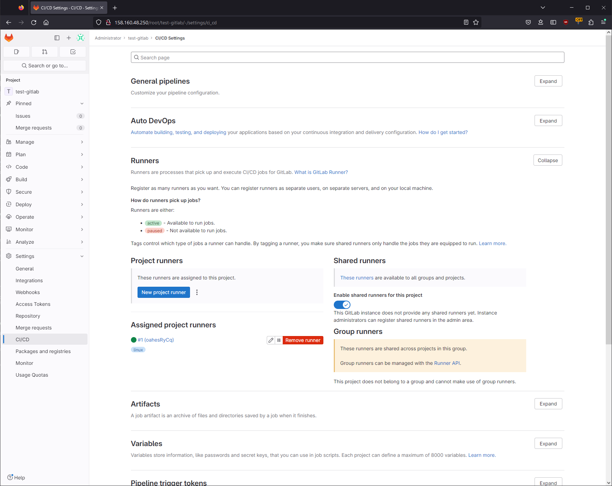

## Основная часть

<details>
  <summary>DevOps</summary>
В репозитории содержится код проекта на Python. Проект — RESTful API сервис. Ваша задача — автоматизировать сборку образа с выполнением python-скрипта:

1. Образ собирается на основе [centos:7](https://hub.docker.com/_/centos?tab=tags&page=1&ordering=last_updated).
2. Python версии не ниже 3.7.
3. Установлены зависимости: `flask` `flask-jsonpify` `flask-restful`.
4. Создана директория `/python_api`.
5. Скрипт из репозитория размещён в /python_api.
6. Точка вызова: запуск скрипта.
7. При комите в любую ветку должен собираться docker image с форматом имени hello:gitlab-$CI_COMMIT_SHORT_SHA . Образ должен быть выложен в Gitlab registry или yandex registry.

</details>

### Ответ

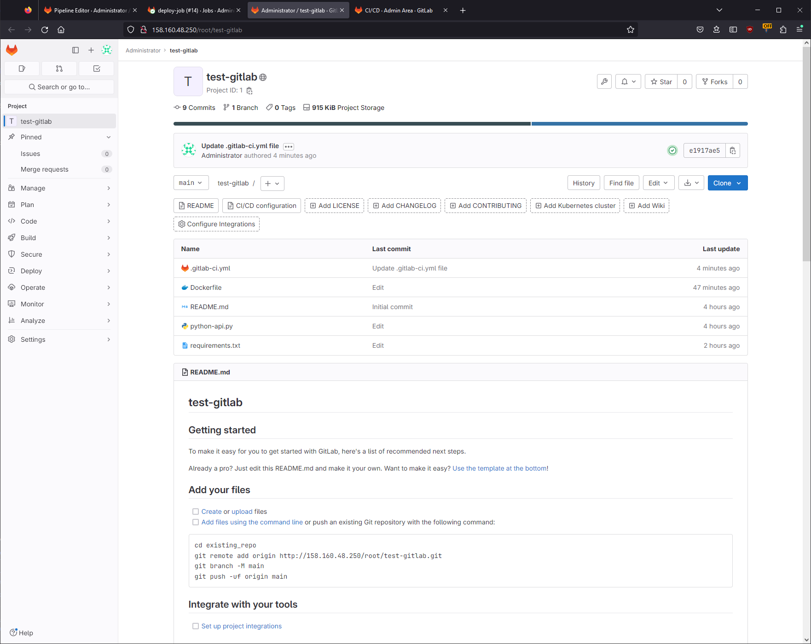

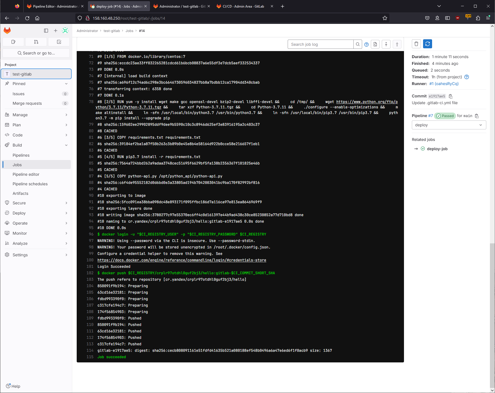

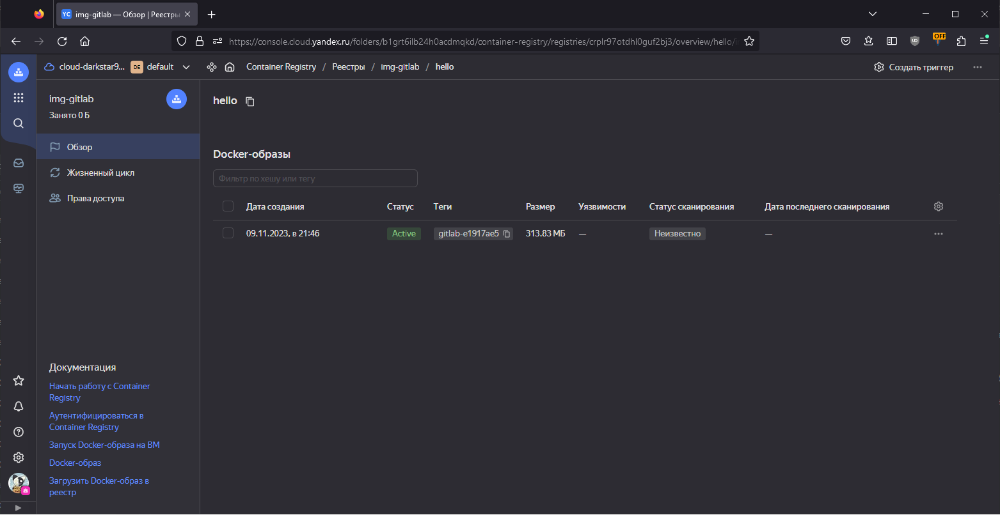

<details>
  <summary>Product Owner</summary>
Вашему проекту нужна бизнесовая доработка: нужно поменять JSON ответа на вызов метода GET `/rest/api/get_info`, необходимо создать Issue в котором указать:

1. Какой метод необходимо исправить.
2. Текст с `{ "message": "Already started" }` на `{ "message": "Running"}`.
3. Issue поставить label: feature.

</details>

### Ответ

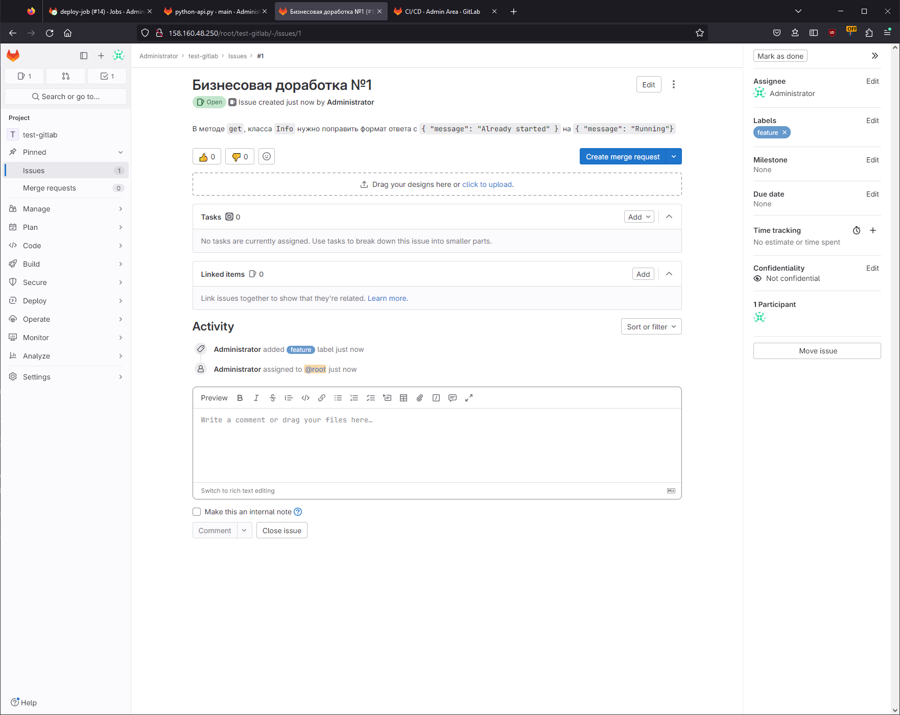

<details>
  <summary>Developer</summary>
Пришёл новый Issue на доработку, вам нужно:

1. Создать отдельную ветку, связанную с этим Issue.
2. Внести изменения по тексту из задания.
3. Подготовить Merge Request, влить необходимые изменения в `master`, проверить, что сборка прошла успешно.

</details>

### Ответ

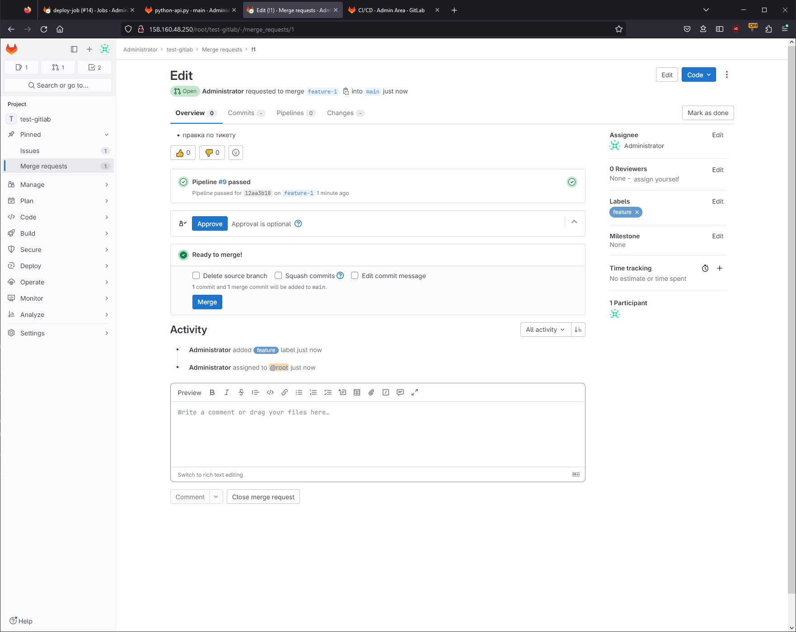

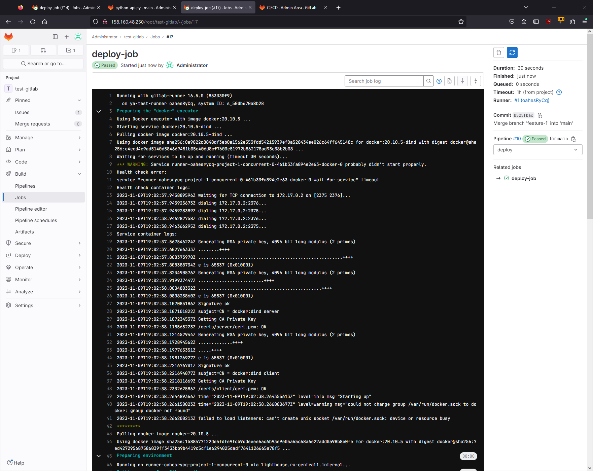

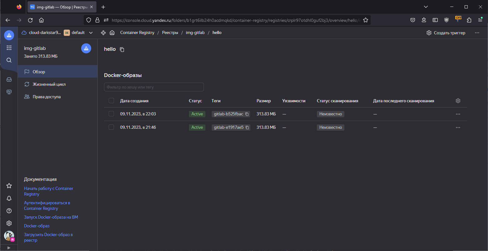

<details>
  <summary>Tester</summary>
Разработчики выполнили новый Issue, необходимо проверить валидность изменений:

1. Поднять докер-контейнер с образом `python-api:latest` и проверить возврат метода на корректность.
2. Закрыть Issue с комментарием об успешности прохождения, указав желаемый результат и фактически достигнутый.

</details>

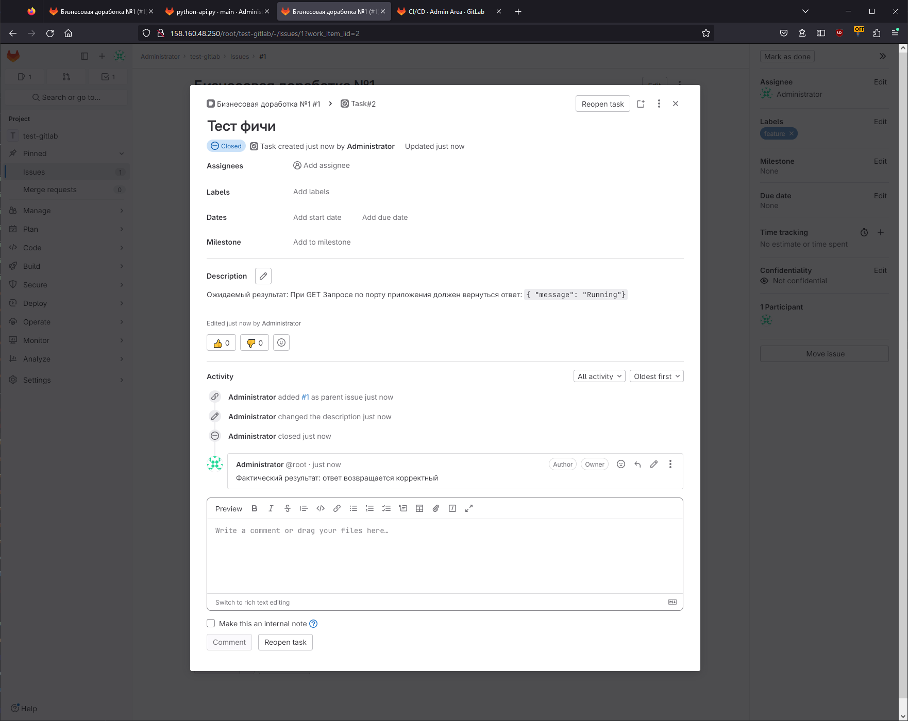

```bash
vagrant@server1:/vagrant$ docker pull cr.yandex/crplr97otdhl0guf2bj3/hello:gitlab-b525fbac
gitlab-b525fbac: Pulling from crplr97otdhl0guf2bj3/hello
2d473b07cdd5: Already exists
a29505bb9a82: Pull complete
e5045ac04c7d: Pull complete
5b318410a6a9: Pull complete
98f96b47336a: Pull complete
Digest: sha256:9cbef89d585f1b55ede09454808d2def6c0d55c8fc8cc3eee831fc238e95fbca
Status: Downloaded newer image for cr.yandex/crplr97otdhl0guf2bj3/hello:gitlab-b525fbac
cr.yandex/crplr97otdhl0guf2bj3/hello:gitlab-b525fbac
vagrant@server1:/vagrant$ docker run -d -p 5290:5290 cr.yandex/crplr97otdhl0guf2bj3/hello:gitlab-b525fbac
3a8d9a10c38bb32548c3baf9650128bf6a55fc716a94266ecc162e0dca0e2781
vagrant@server1:/vagrant$ curl localhost:5290/get_info
{"version": 3, "method": "GET", "message": "Running"}
```

## Итог

В качестве ответа пришлите подробные скриншоты по каждому пункту задания:

- файл gitlab-ci.yml;

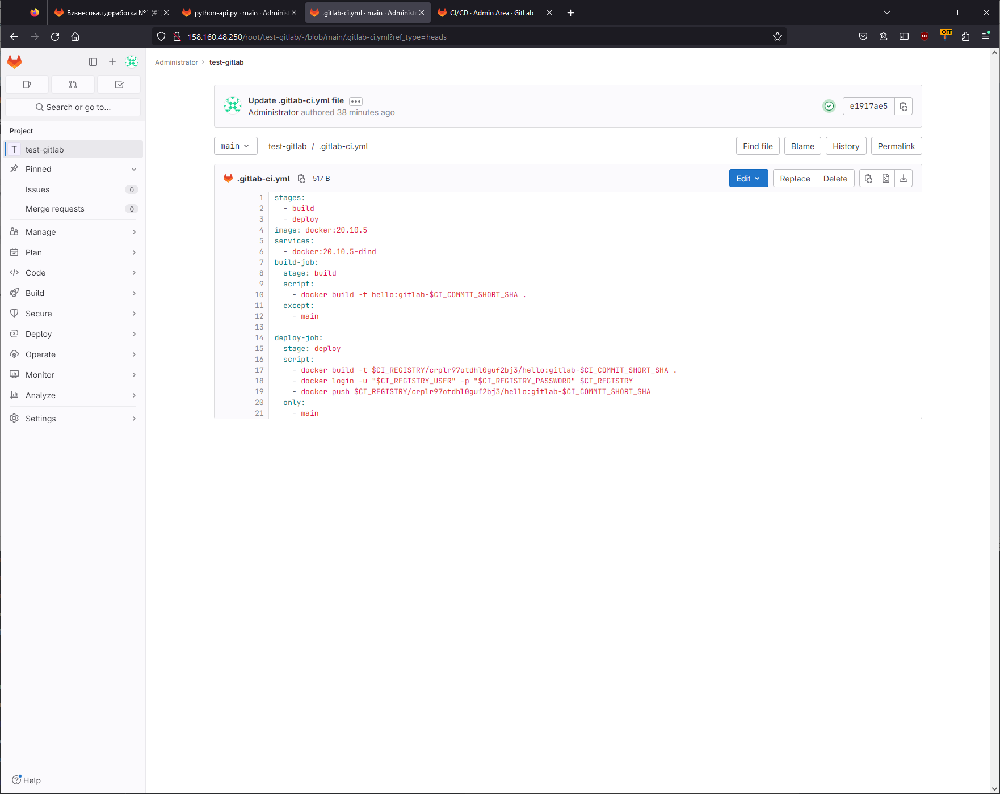

- Dockerfile;

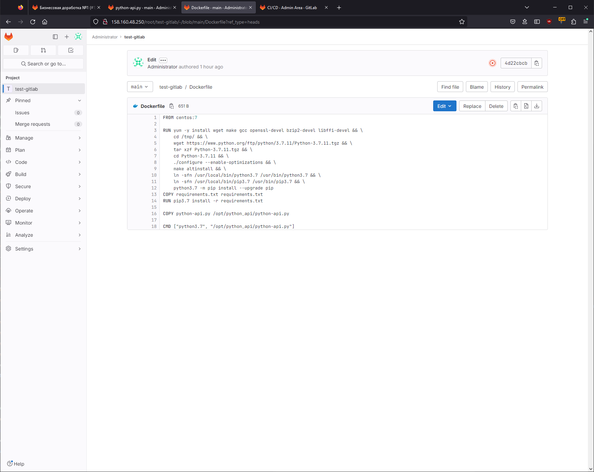

- лог успешного выполнения пайплайна;

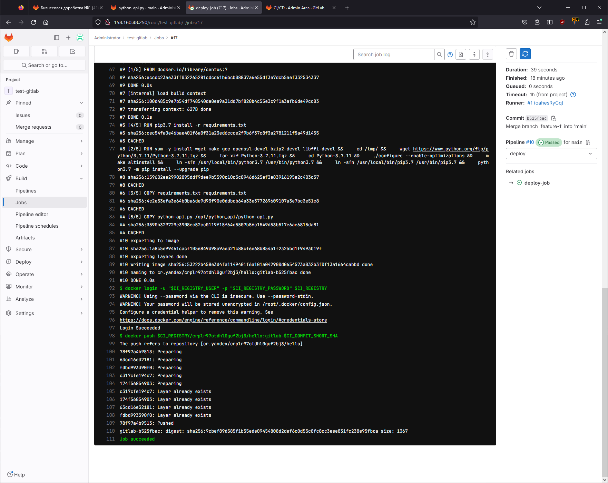

- решённый Issue.

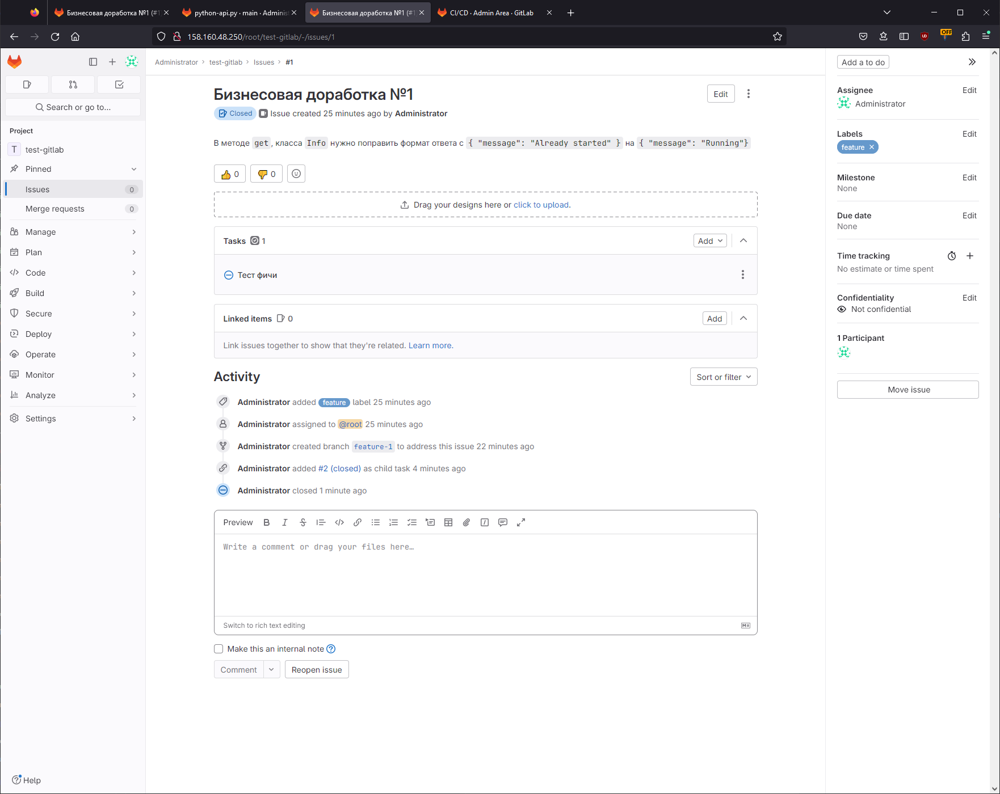