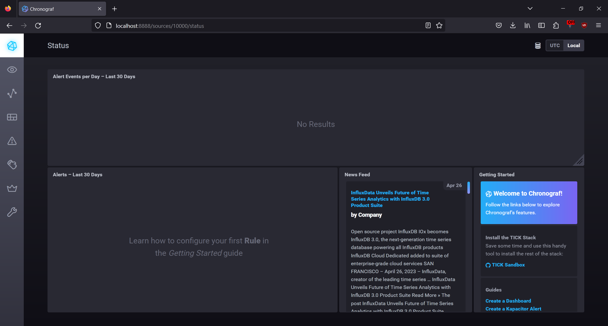
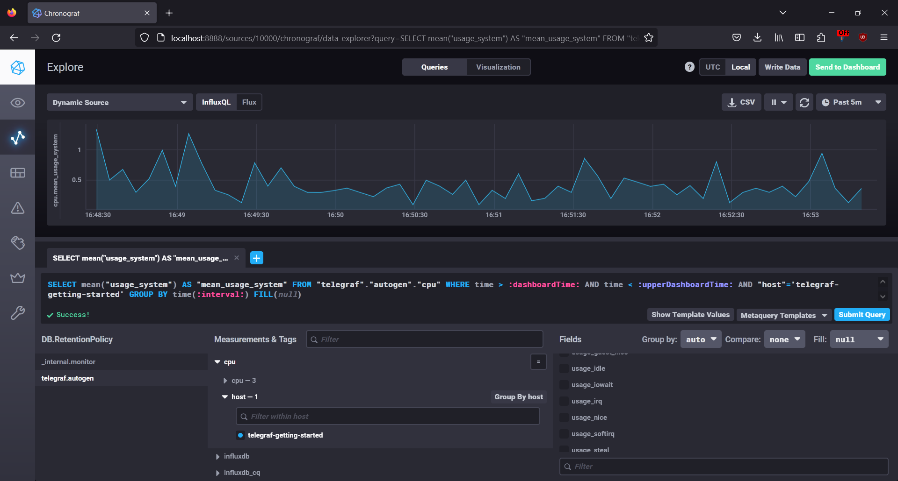
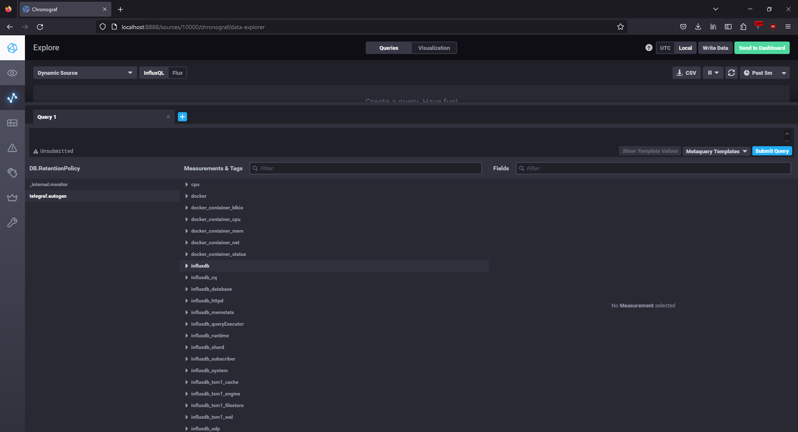

# Домашнее задание к занятию "13.Системы мониторинга"

<details>
  <summary>Задание 1</summary>
Вас пригласили настроить мониторинг на проект. На онбординге вам рассказали, что проект представляет из себя
платформу для вычислений с выдачей текстовых отчетов, которые сохраняются на диск. Взаимодействие с платформой
осуществляется по протоколу http. Также вам отметили, что вычисления загружают ЦПУ. Какой минимальный набор метрик вы
выведите в мониторинг и почему?
</details>

### Ответ

Минимальный набор метрик: CPUla, IOPS, FS, время исполнения запросов, количество ошибок

- CPUla, т.к. система зависит от уровня загрузки ЦПУ и в случае повышенных показателей может случиться деградация в процессе формирования отчетов
- IOPS, FS показатели утилизации диска + свободное место, складываем результаты на локальный диск, поэтому нужно отслеживать его состояние для своевременного реагирования
- время исполнения запросов, количество ошибок: стандартные метрики для веб-сервиса для понимания состояния сервиса

<details>
  <summary>Задание 2</summary>
Менеджер продукта посмотрев на ваши метрики сказал, что ему непонятно что такое RAM/inodes/CPUla. Также он сказал, 
что хочет понимать, насколько мы выполняем свои обязанности перед клиентами и какое качество обслуживания. Что вы 
можете ему предложить?
</details>

### Ответ

RAM/inodes/CPUla данные метрики относятся к инфрастурктурным, а не продуктовым, в качестве продуктовых можно использовать:

Время исполнения запросов - на основании его можно понимать сколько времени клиент затрачивает на ту или иную операцию и если есть запросы, которые обрабатываются долго, это может свидетельствовать, что пользователь не очень будет доволен предоставляемым сервисом;

Отслеживание количества операций — покажет те функции продукта, которые пользуются наибольшей популярностью, так же как и не популярный функционал;

Среднее время работы — это среднее время, которое пользователь проводит на сайте или в приложении. Эта метрика позволит оценить удобство использования продукта;

Количество ошибок — покажет насколько качественный продукт и как часто пользователи сталкиваются с проблемами при эксплуатации.

<details>
  <summary>Задание 3</summary>
Вашей DevOps команде в этом году не выделили финансирование на построение системы сбора логов. Разработчики в свою 
очередь хотят видеть все ошибки, которые выдают их приложения. Какое решение вы можете предпринять в этой ситуации, 
чтобы разработчики получали ошибки приложения?
</details>

### Ответ

1. Использование локального журнала (лога), дать доступ разработчикам, чтобы могли анализировать и изучать возникшие ошибки.

1. Использование фреймворка для регистрации ошибок: на уровне кода предусмотреть способы информирования о возникшей ошибке с ее детализацией, для отправки данных на почту к разработчикам

1. Использование бесплатных или открытых инструментов сбора логов, если есть свободные мощности для поднятия инстансов (CPU/RAM/HDD)

<details>
  <summary>Задание 4</summary>
Вы, как опытный SRE, сделали мониторинг, куда вывели отображения выполнения SLA=99% по http кодам ответов. 
Вычисляете этот параметр по следующей формуле: summ_2xx_requests/summ_all_requests. Данный параметр не поднимается выше 
70%, но при этом в вашей системе нет кодов ответа 5xx и 4xx. Где у вас ошибка?
</details>

### Ответ

Допущена ошибка в формуле для вычисления SLA. Фактически, для расчета SLA по кодам ответов, нужно использовать следующую формулу: summ_2xx_requests/summ_all_non_5xx_requests.

При делении 2xx_requests/summ_all_requests учитываются все запросы в знаменателе, включая как успешные (2xx), так и неуспешные (4xx и 5xx). Это приводит к неправильному расчету SLA.

<details>
  <summary>Задание 5</summary>
Опишите основные плюсы и минусы pull и push систем мониторинга.
</details>

### Ответ

Основные преимущества pull-систем мониторинга:

1. Надежность — данные всегда доступны на центральном сервере, даже если устройство отключено.

2. Гибкость — можно настроить различные параметры сбора данных, такие как частота сбора, формат файлов и т.д.

3. Простота — данные легко собираются и передаются на центральный сервер.

Недостатки:

1. Зависимость от сетевого соединения — если устройство не подключено к сети, то данные не будут собраны.

2. Невозможность обновления устройства без остановки процесса сбора данных.

Основные преимущества push-систем мониторинга включают в себя:

1. Высокая скорость — данные передаются непосредственно на центральный сервер, что позволяет быстро получать информацию.

2. Отсутствие зависимости от сетевого соединения — данные передаются автоматически, даже если устройство отключено от сети.

3. Возможность обновления устройства без остановки процесса сбора данных.

Недостатки:

1. Необходимость наличия достаточного количества ресурсов на устройстве для передачи данных на центральный сервер.

2. Ограниченность возможностей анализа данных — не все типы данных могут быть переданы через push-систему мониторинга.

<details>
  <summary>Задание 6</summary>
Какие из ниже перечисленных систем относятся к push модели, а какие к pull? А может есть гибридные?

    - Prometheus 
    - TICK
    - Zabbix
    - VictoriaMetrics
    - Nagios
</details>

### Ответ

Prometheus, TICK, Zabbix и VictoriaMetrics являются pull-системами мониторинга, так как данные собираются с устройств и передаются на центральный сервер для анализа. Nagios является гибридной системой мониторинга, которая может работать как pull, так и push в зависимости от настроек.

<details>
  <summary>Задание 7</summary>
Склонируйте себе [репозиторий](https://github.com/influxdata/sandbox/tree/master) и запустите TICK-стэк, 
используя технологии docker и docker-compose.

В виде решения на это упражнение приведите скриншот веб-интерфейса ПО chronograf (`http://localhost:8888`). 

P.S.: если при запуске некоторые контейнеры будут падать с ошибкой - проставьте им режим `Z`, например
`./data:/var/lib:Z`
</details>

### Ответ



<details>
  <summary>Задание 8</summary>
Перейдите в веб-интерфейс Chronograf (http://localhost:8888) и откройте вкладку Data explorer.

    - Нажмите на кнопку Add a query
    - Изучите вывод интерфейса и выберите БД telegraf.autogen
    - В `measurments` выберите cpu->host->telegraf-getting-started, а в `fields` выберите usage_system. Внизу появится график утилизации cpu.
    - Вверху вы можете увидеть запрос, аналогичный SQL-синтаксису. Поэкспериментируйте с запросом, попробуйте изменить группировку и интервал наблюдений.

Для выполнения задания приведите скриншот с отображением метрик утилизации cpu из веб-интерфейса.
</details>

### Ответ



<details>
  <summary>Задание 9</summary>
Изучите список [telegraf inputs](https://github.com/influxdata/telegraf/tree/master/plugins/inputs). 
Добавьте в конфигурацию telegraf следующий плагин - [docker](https://github.com/influxdata/telegraf/tree/master/plugins/inputs/docker):
```
[[inputs.docker]]
  endpoint = "unix:///var/run/docker.sock"
```

Дополнительно вам может потребоваться донастройка контейнера telegraf в `docker-compose.yml` дополнительного volume и 
режима privileged:
```
  telegraf:
    image: telegraf:1.4.0
    privileged: true
    volumes:
      - ./etc/telegraf.conf:/etc/telegraf/telegraf.conf:Z
      - /var/run/docker.sock:/var/run/docker.sock:Z
    links:
      - influxdb
    ports:
      - "8092:8092/udp"
      - "8094:8094"
      - "8125:8125/udp"
```

После настройке перезапустите telegraf, обновите веб интерфейс и приведите скриншотом список `measurments` в 
веб-интерфейсе базы telegraf.autogen . Там должны появиться метрики, связанные с docker.

Факультативно можете изучить какие метрики собирает telegraf после выполнения данного задания.
</details>

### Ответ

