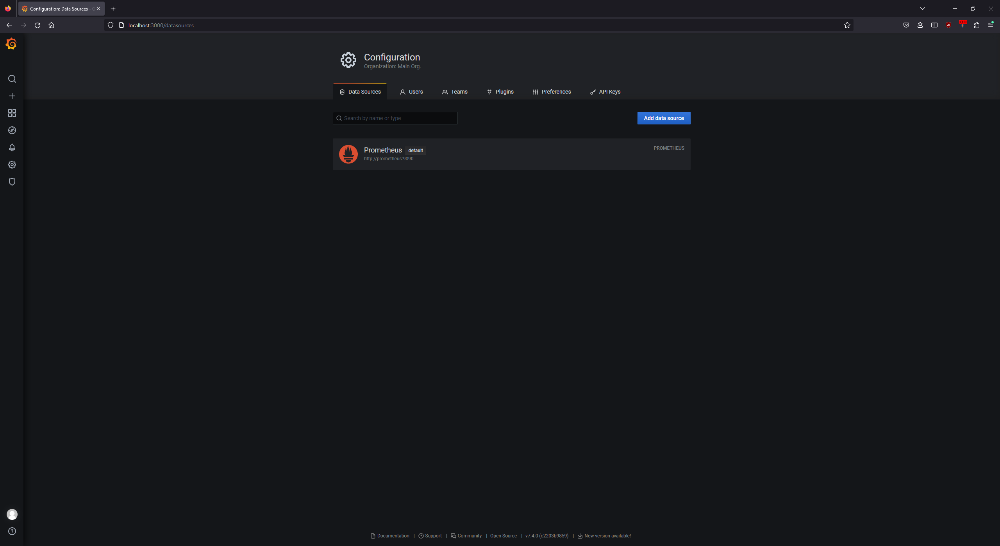
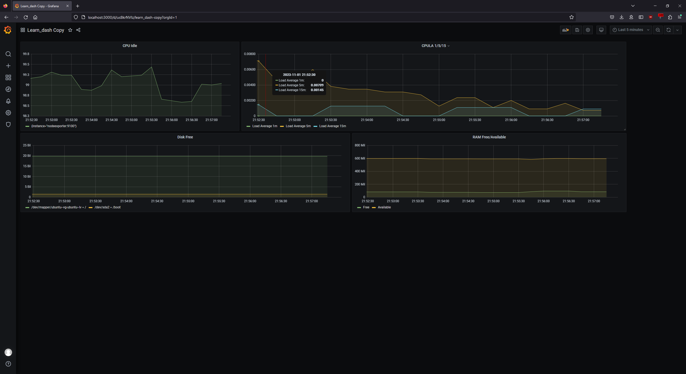
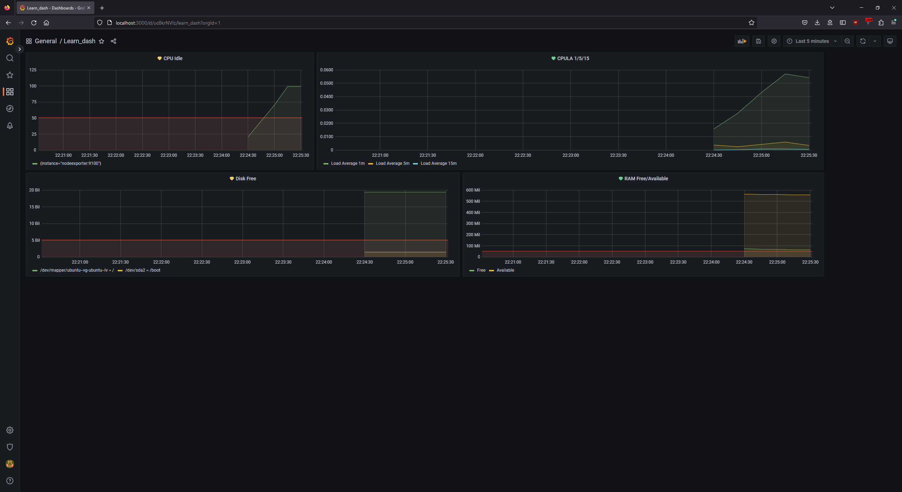
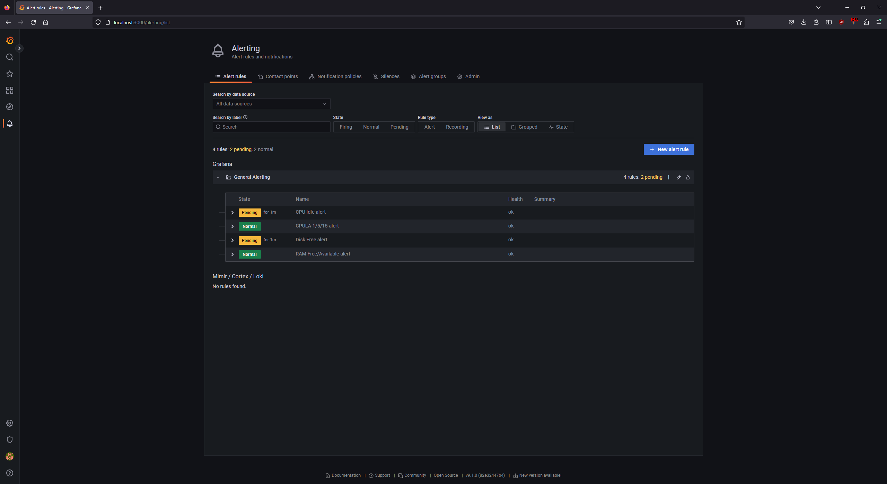

# Домашнее задание к занятию 14 «Средство визуализации Grafana»

<details>
  <summary>Задание 1</summary>
1. Используя директорию [help](./help) внутри этого домашнего задания, запустите связку prometheus-grafana.
1. Зайдите в веб-интерфейс grafana, используя авторизационные данные, указанные в манифесте docker-compose.
1. Подключите поднятый вами prometheus, как источник данных.
1. Решение домашнего задания — скриншот веб-интерфейса grafana со списком подключенных Datasource.
</details>


### Ответ



<details>
  <summary>Задание 2</summary>
Создайте Dashboard и в ней создайте Panels:

- утилизация CPU для nodeexporter (в процентах, 100-idle);
- CPULA 1/5/15;
- количество свободной оперативной памяти;
- количество места на файловой системе.

Для решения этого задания приведите promql-запросы для выдачи этих метрик, а также скриншот получившейся Dashboard.
</details>


### Ответ

#### утилизация CPU для nodeexporter (в процентах, 100-idle);

```promql
avg by(instance)(rate(node_cpu_seconds_total{job="nodeexporter", mode="idle"}[$__rate_interval])) * 100
```

#### CPULA 1/5/15;

```promql
avg by (instance)(rate(node_load1{}[$__rate_interval]))
avg by (instance)(rate(node_load5{}[$__rate_interval]))
avg by (instance)(rate(node_load15{}[$__rate_interval]))
```

#### количество свободной оперативной памяти;

```promql
avg(node_memory_MemFree_bytes{instance="nodeexporter:9100", job="nodeexporter"})
avg(node_memory_MemAvailable_bytes{instance="nodeexporter:9100", job="nodeexporter"})
```

#### количество места на файловой системе.

```promql
node_filesystem_free_bytes{fstype="ext4",instance="nodeexporter:9100",job="nodeexporter"}
```



<details>
  <summary>Задание 3</summary>

1. Создайте для каждой Dashboard подходящее правило alert — можно обратиться к первой лекции в блоке «Мониторинг».
1. В качестве решения задания приведите скриншот вашей итоговой Dashboard.

</details>


### Ответ





<details>
  <summary>Задание 4</summary>

1. Сохраните ваш Dashboard.Для этого перейдите в настройки Dashboard, выберите в боковом меню «JSON MODEL». Далее скопируйте отображаемое json-содержимое в отдельный файл и сохраните его.
1. В качестве решения задания приведите листинг этого файла.

</details>

### Ответ

[dash.json](dash.json)