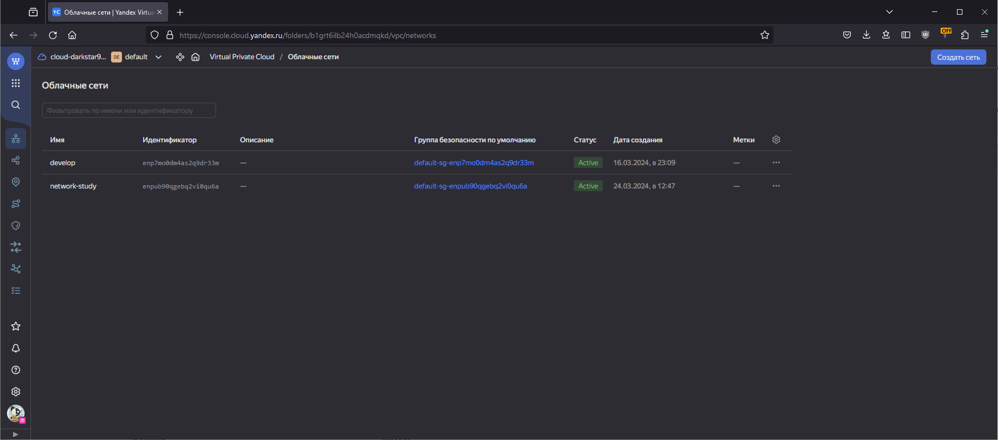
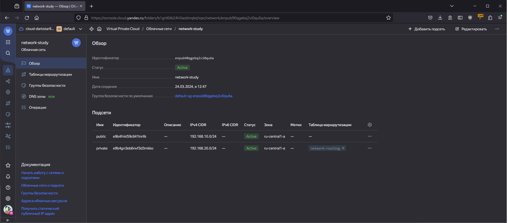
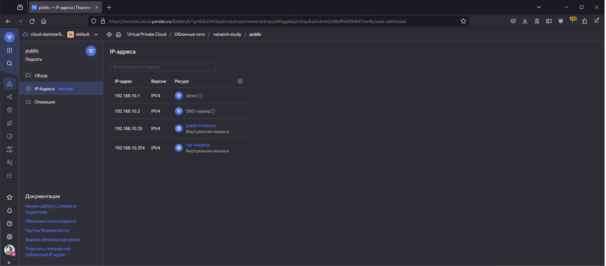

# Домашнее задание к занятию «Организация сети»

<details>
  <summary><b>Задание 1. Yandex Cloud </b></summary>

1. Создать пустую VPC. Выбрать зону.
2. Публичная подсеть.

- Создать в VPC subnet с названием public, сетью 192.168.10.0/24.
- Создать в этой подсети NAT-инстанс, присвоив ему адрес 192.168.10.254. В качестве image_id использовать fd80mrhj8fl2oe87o4e1.
- Создать в этой публичной подсети виртуалку с публичным IP, подключиться к ней и убедиться, что есть доступ к интернету.

3. Приватная подсеть.

- Создать в VPC subnet с названием private, сетью 192.168.20.0/24.
- Создать route table. Добавить статический маршрут, направляющий весь исходящий трафик private сети в NAT-инстанс.
- Создать в этой приватной подсети виртуалку с внутренним IP, подключиться к ней через виртуалку, созданную ранее, и убедиться, что есть доступ к интернету.

</details>

## Ответ

### 1. Создать пустую VPC. Выбрать зону

```terraform
resource "yandex_vpc_network" "network-study" {
  name = "network-study"
}
```



### 2. Публичная подсеть

```terraform
resource "yandex_vpc_subnet" "public" {
  name           = "public"
  zone           = var.default_zone
  network_id     = yandex_vpc_network.network-study.id
  v4_cidr_blocks = ["192.168.10.0/24"]
}

resource "yandex_compute_instance" "nat-instance" {
  name = "nat-instance"
  hostname = "nat-instance"
  zone     = var.default_zone
  resources {
    cores  = 2
    memory = 2
  }
  boot_disk {
    initialize_params {
      image_id = "fd8ffdc2pn79k1j2d5os"
    }
  }
  network_interface {
    subnet_id = yandex_vpc_subnet.public.id
    ip_address = "192.168.10.254"
    nat       = true
  }
  metadata = {
    ssh-keys = "ubuntu:ssh-ed25519 AAAAC3NzaC1lZDI1NTE5AAAAIAJkjyC8jM6WyALVI5h/cBOLtxO/OsxSU6Matw+HHefF"
  }
}

resource "yandex_compute_instance" "public-instance" {
  name = "public-instance"
  hostname = "public-instance"
  zone     = var.default_zone
  resources {
    cores  = 2
    memory = 2
  }
  boot_disk {
    initialize_params {
      image_id = "fd8ne6e3etbrr2ve9nlc"
    }
  }
  network_interface {
    subnet_id = yandex_vpc_subnet.public.id
    nat       = true
  }
  metadata = {
    ssh-keys = "ubuntu:ssh-ed25519 AAAAC3NzaC1lZDI1NTE5AAAAIAJkjyC8jM6WyALVI5h/cBOLtxO/OsxSU6Matw+HHefF"
  }
}
```

#### Проверка доступа до интернета

```bash
ubuntu@public-instance:~$ curl google.com
<HTML><HEAD><meta http-equiv="content-type" content="text/html;charset=utf-8">
<TITLE>301 Moved</TITLE></HEAD><BODY>
<H1>301 Moved</H1>
The document has moved
<A HREF="http://www.google.com/">here</A>.
</BODY></HTML>
```

### 3. Приватная подсеть

```terraform
resource "yandex_vpc_subnet" "private" {
  name           = "private"
  zone           = var.default_zone
  network_id     = yandex_vpc_network.network-study.id
  route_table_id = yandex_vpc_route_table.network-routing.id
  v4_cidr_blocks = ["192.168.20.0/24"]
}

resource "yandex_vpc_route_table" "network-routing" {
  name       = "network-routing"
  network_id = yandex_vpc_network.network-study.id
  static_route {
    destination_prefix = "0.0.0.0/0"
    next_hop_address   = "192.168.10.254"
  }
}

resource "yandex_compute_instance" "private-instance" {
  name = "private-instance"
  hostname = "private-instance"
  zone     = var.default_zone
  resources {
    cores  = 2
    memory = 2
  }
  boot_disk {
    initialize_params {
      image_id = "fd8ne6e3etbrr2ve9nlc"
    }
  }
  network_interface {
    subnet_id = yandex_vpc_subnet.private.id
  }
  metadata = {
    ssh-keys = "ubuntu:ssh-ed25519 AAAAC3NzaC1lZDI1NTE5AAAAIAJkjyC8jM6WyALVI5h/cBOLtxO/OsxSU6Matw+HHefF"
  }
}
```

#### Проверка доступа до Интернет

```bash
ubuntu@public-instance:~$ ssh ubuntu@192.168.20.33
Welcome to Ubuntu 22.04.4 LTS (GNU/Linux 5.15.0-100-generic x86_64)
...
ubuntu@private-instance:~$ ping google.com
PING google.com (173.194.220.100) 56(84) bytes of data.
64 bytes from lk-in-f100.1e100.net (173.194.220.100): icmp_seq=1 ttl=54 time=30.7 ms
64 bytes from lk-in-f100.1e100.net (173.194.220.100): icmp_seq=2 ttl=54 time=29.0 ms
64 bytes from lk-in-f100.1e100.net (173.194.220.100): icmp_seq=3 ttl=54 time=29.1 ms
64 bytes from lk-in-f100.1e100.net (173.194.220.100): icmp_seq=4 ttl=54 time=29.1 ms
ubuntu@private-instance:~$ curl google.com
<HTML><HEAD><meta http-equiv="content-type" content="text/html;charset=utf-8">
<TITLE>301 Moved</TITLE></HEAD><BODY>
<H1>301 Moved</H1>
The document has moved
<A HREF="http://www.google.com/">here</A>.
</BODY></HTML>
```

### Скриншоты ресурсов в консоли





