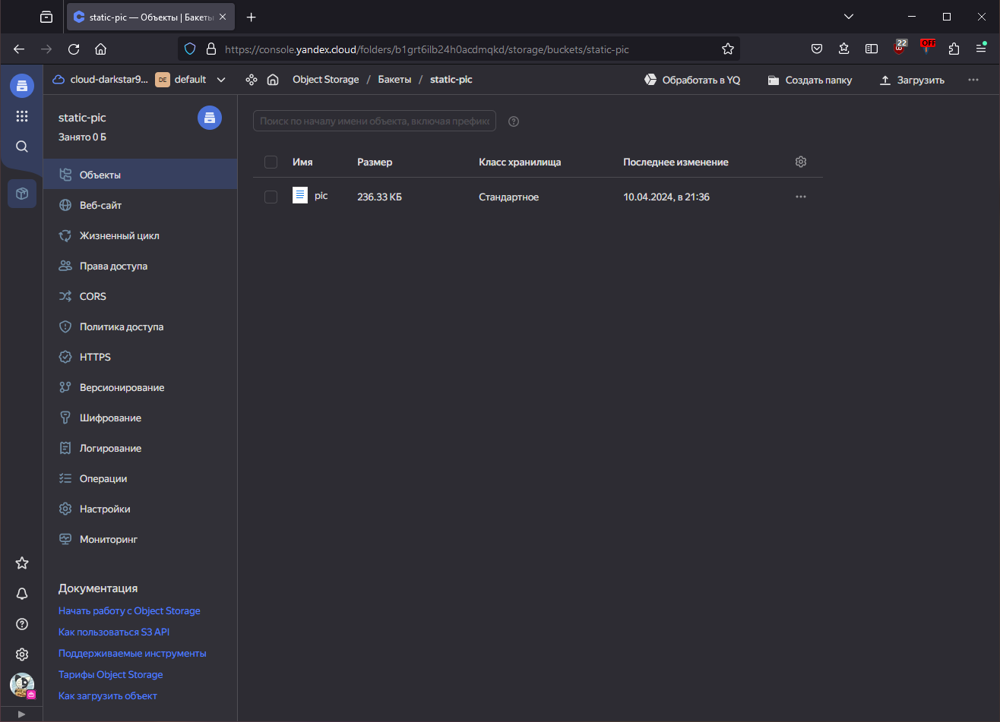
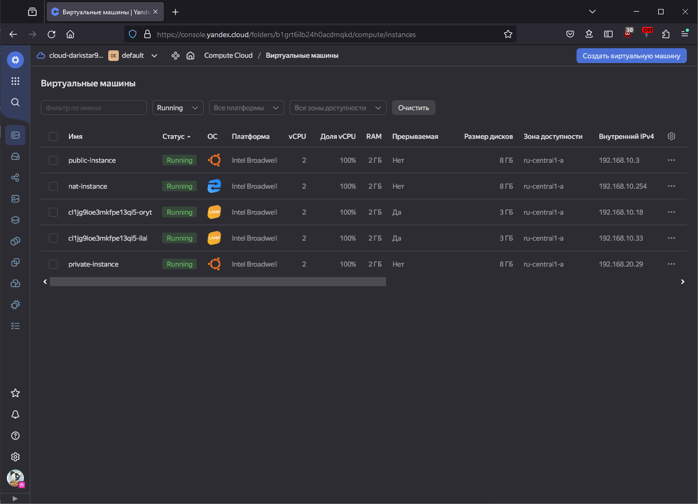
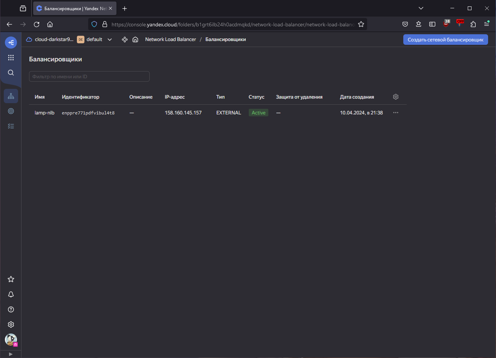
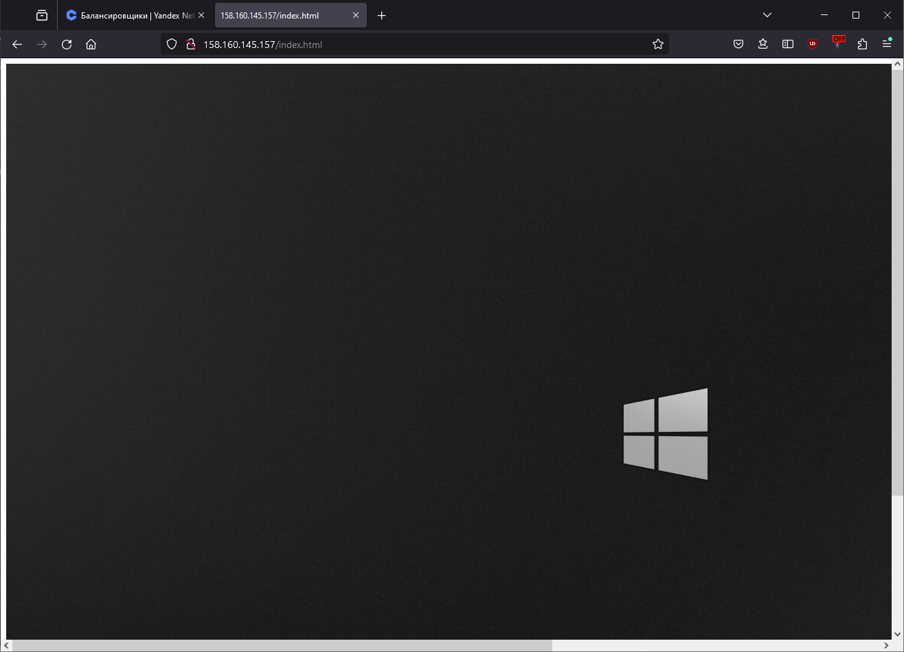

# Домашнее задание к занятию «Вычислительные мощности. Балансировщики нагрузки»  

<details>
  <summary><b>Задание 1. Yandex Cloud</b></summary>

**Что нужно сделать**

1. Создать бакет Object Storage и разместить в нём файл с картинкой:

- Создать бакет в Object Storage с произвольным именем (например, _имя_студента_дата_).
- Положить в бакет файл с картинкой.
- Сделать файл доступным из интернета.

2. Создать группу ВМ в public подсети фиксированного размера с шаблоном LAMP и веб-страницей, содержащей ссылку на картинку из бакета:

- Создать Instance Group с тремя ВМ и шаблоном LAMP. Для LAMP рекомендуется использовать `image_id = fd827b91d99psvq5fjit`.
- Для создания стартовой веб-страницы рекомендуется использовать раздел `user_data` в [meta_data](https://cloud.yandex.ru/docs/compute/concepts/vm-metadata).
- Разместить в стартовой веб-странице шаблонной ВМ ссылку на картинку из бакета.
- Настроить проверку состояния ВМ.

3. Подключить группу к сетевому балансировщику:

- Создать сетевой балансировщик.
- Проверить работоспособность, удалив одну или несколько ВМ.

</details>

## Ответ

### 1. Создать бакет Object Storage и разместить в нём файл с картинкой

<details>
  <summary>s3_bucket.tf</summary>

```terraform
  resource "yandex_iam_service_account" "s3-bucket" {
    name      = "acc-bucket"
}

resource "yandex_resourcemanager_folder_iam_member" "s3-bucket-editor" {
  folder_id = "${var.folder_id}"
  role      = "storage.editor"
  member    = "serviceAccount:${yandex_iam_service_account.s3-bucket.id}"
}

resource "yandex_iam_service_account_static_access_key" "s3-bucket-key" {
  service_account_id = yandex_iam_service_account.s3-bucket.id
  description        = "access key for s3"
}

resource "yandex_storage_bucket" "static-pic" {
    access_key = yandex_iam_service_account_static_access_key.s3-bucket-key.access_key
    secret_key = yandex_iam_service_account_static_access_key.s3-bucket-key.secret_key
    bucket = "static-pic"
    acl    = "public-read"
}

resource "yandex_storage_object" "pic" {
  access_key = yandex_iam_service_account_static_access_key.s3-bucket-key.access_key
  secret_key = yandex_iam_service_account_static_access_key.s3-bucket-key.secret_key
  bucket     = yandex_storage_bucket.static-pic.bucket
  key        = "pic"
  source     = "./pic_s3/winBlack.jpg"
}
```

</details>



## 2. Создать группу ВМ в public подсети фиксированного размера с шаблоном LAMP и веб-страницей, содержащей ссылку на картинку из бакета

<details>
  <summary>lamp.tf</summary>

```terraform
resource "yandex_iam_service_account" "lamp-group-acc" {
    name      = "lamp-group-acc"
}

resource "yandex_resourcemanager_folder_iam_member" "lamp-group-editor" {
    folder_id = var.folder_id
    role      = "editor"
    member    = "serviceAccount:${yandex_iam_service_account.lamp-group-acc.id}"
}

resource "yandex_compute_instance_group" "lamp-instance-group" {
  name                = "lamp-instance-group"
  service_account_id  = "${yandex_iam_service_account.lamp-group-acc.id}"
  deletion_protection = false
  instance_template {
    
    resources {
      memory = 2
      cores  = 2
    }

    boot_disk {
      initialize_params {
        image_id = "fd827b91d99psvq5fjit"
      }
    }

    network_interface {
      network_id = yandex_vpc_network.network-study.id
      subnet_ids = [yandex_vpc_subnet.public.id]
      nat        = true
    }

    metadata = {
      user-data  = <<EOF
#!/bin/bash
echo '<html></html>' > /var/www/html/index.html
EOF
      ssh-keys = "ubuntu:ssh-ed25519 AAAAC3NzaC1lZDI1NTE5AAAAIAJkjyC8jM6WyALVI5h/cBOLtxO/OsxSU6Matw+HHefF"
    }

    scheduling_policy {
      preemptible = true
    }
  }

  scale_policy {
    fixed_scale {
      size = 2
    }
  }

  allocation_policy {
    zones = [var.default_zone]
  }

  deploy_policy {
    max_unavailable = 2
    max_creating    = 2
    max_expansion   = 2
    max_deleting    = 2
  }

  health_check {
    http_options {
      port    = 80
      path    = "/"
    }
  }

  load_balancer {
    target_group_name = "some-group"
  }
}
```

</details>



## 3. Подключить группу к сетевому балансировщику

<details>
  <summary>lb.tf</summary>

```terraform
resource "yandex_lb_network_load_balancer" "lamp-nlb" {
  name = "lamp-nlb"

  listener {
    name = "lamp-instances"
    port = 80
    external_address_spec {
      ip_version = "ipv4"
    }
  }

  attached_target_group {
    target_group_id = yandex_compute_instance_group.lamp-instance-group.load_balancer[0].target_group_id

    healthcheck {
      name = "http"
      http_options {
        port = 80
        path = "/"
      }
    }
  }
}
```

</details>





<details>
  <summary>Лог работы terraform</summary>

```bash
PS D:\Lern_netology\net_virt2\src\network_ya> .\terraform.exe apply  

Terraform used the selected providers to generate the following execution plan. Resource actions are indicated with the following symbols:
  + create

Terraform will perform the following actions:

  # yandex_compute_instance.nat-instance will be created
  + resource "yandex_compute_instance" "nat-instance" {
      + created_at                = (known after apply)
      + folder_id                 = (known after apply)
      + fqdn                      = (known after apply)
      + gpu_cluster_id            = (known after apply)
      + hostname                  = "nat-instance"
      + id                        = (known after apply)
      + maintenance_grace_period  = (known after apply)
      + maintenance_policy        = (known after apply)
      + metadata                  = {
          + "ssh-keys" = "ubuntu:ssh-ed25519 AAAAC3NzaC1lZDI1NTE5AAAAIAJkjyC8jM6WyALVI5h/cBOLtxO/OsxSU6Matw+HHefF"
        }
      + name                      = "nat-instance"
      + network_acceleration_type = "standard"
      + platform_id               = "standard-v1"
      + service_account_id        = (known after apply)
      + status                    = (known after apply)
      + zone                      = "ru-central1-a"

      + boot_disk {
          + auto_delete = true
          + device_name = (known after apply)
          + disk_id     = (known after apply)
          + mode        = (known after apply)

          + initialize_params {
              + block_size  = (known after apply)
              + description = (known after apply)
              + image_id    = "fd8ffdc2pn79k1j2d5os"
              + name        = (known after apply)
              + size        = (known after apply)
              + snapshot_id = (known after apply)
              + type        = "network-hdd"
            }
        }

      + network_interface {
          + index              = (known after apply)
          + ip_address         = "192.168.10.254"
          + ipv4               = true
          + ipv6               = (known after apply)
          + ipv6_address       = (known after apply)
          + mac_address        = (known after apply)
          + nat                = true
          + nat_ip_address     = (known after apply)
          + nat_ip_version     = (known after apply)
          + security_group_ids = (known after apply)
          + subnet_id          = (known after apply)
        }

      + resources {
          + core_fraction = 100
          + cores         = 2
          + memory        = 2
        }
    }

  # yandex_compute_instance.private-instance will be created
  + resource "yandex_compute_instance" "private-instance" {
      + created_at                = (known after apply)
      + folder_id                 = (known after apply)
      + fqdn                      = (known after apply)
      + gpu_cluster_id            = (known after apply)
      + hostname                  = "private-instance"
      + id                        = (known after apply)
      + maintenance_grace_period  = (known after apply)
      + maintenance_policy        = (known after apply)
      + metadata                  = {
          + "ssh-keys" = "ubuntu:ssh-ed25519 AAAAC3NzaC1lZDI1NTE5AAAAIAJkjyC8jM6WyALVI5h/cBOLtxO/OsxSU6Matw+HHefF"
        }
      + name                      = "private-instance"
      + network_acceleration_type = "standard"
      + platform_id               = "standard-v1"
      + service_account_id        = (known after apply)
      + status                    = (known after apply)
      + zone                      = "ru-central1-a"

      + boot_disk {
          + auto_delete = true
          + device_name = (known after apply)
          + disk_id     = (known after apply)
          + mode        = (known after apply)

          + initialize_params {
              + block_size  = (known after apply)
              + description = (known after apply)
              + image_id    = "fd8ne6e3etbrr2ve9nlc"
              + name        = (known after apply)
              + size        = (known after apply)
              + snapshot_id = (known after apply)
              + type        = "network-hdd"
            }
        }

      + network_interface {
          + index              = (known after apply)
          + ip_address         = (known after apply)
          + ipv4               = true
          + ipv6               = (known after apply)
          + ipv6_address       = (known after apply)
          + mac_address        = (known after apply)
          + nat                = false
          + nat_ip_address     = (known after apply)
          + nat_ip_version     = (known after apply)
          + security_group_ids = (known after apply)
          + subnet_id          = (known after apply)
        }

      + resources {
          + core_fraction = 100
          + cores         = 2
          + memory        = 2
        }
    }

  # yandex_compute_instance.public-instance will be created
  + resource "yandex_compute_instance" "public-instance" {
      + created_at                = (known after apply)
      + folder_id                 = (known after apply)
      + fqdn                      = (known after apply)
      + gpu_cluster_id            = (known after apply)
      + hostname                  = "public-instance"
      + id                        = (known after apply)
      + maintenance_grace_period  = (known after apply)
      + maintenance_policy        = (known after apply)
      + metadata                  = {
          + "ssh-keys" = "ubuntu:ssh-ed25519 AAAAC3NzaC1lZDI1NTE5AAAAIAJkjyC8jM6WyALVI5h/cBOLtxO/OsxSU6Matw+HHefF"
        }
      + name                      = "public-instance"
      + network_acceleration_type = "standard"
      + platform_id               = "standard-v1"
      + service_account_id        = (known after apply)
      + status                    = (known after apply)
      + zone                      = "ru-central1-a"

      + boot_disk {
          + auto_delete = true
          + device_name = (known after apply)
          + disk_id     = (known after apply)
          + mode        = (known after apply)

          + initialize_params {
              + block_size  = (known after apply)
              + description = (known after apply)
              + image_id    = "fd8ne6e3etbrr2ve9nlc"
              + name        = (known after apply)
              + size        = (known after apply)
              + snapshot_id = (known after apply)
              + type        = "network-hdd"
            }
        }

      + network_interface {
          + index              = (known after apply)
          + ip_address         = (known after apply)
          + ipv4               = true
          + ipv6               = (known after apply)
          + ipv6_address       = (known after apply)
          + mac_address        = (known after apply)
          + nat                = true
          + nat_ip_address     = (known after apply)
          + nat_ip_version     = (known after apply)
          + security_group_ids = (known after apply)
          + subnet_id          = (known after apply)
        }

      + resources {
          + core_fraction = 100
          + cores         = 2
          + memory        = 2
        }
    }

  # yandex_compute_instance_group.lamp-instance-group will be created
  + resource "yandex_compute_instance_group" "lamp-instance-group" {
      + created_at          = (known after apply)
      + deletion_protection = false
      + folder_id           = (known after apply)
      + id                  = (known after apply)
      + instances           = (known after apply)
      + name                = "lamp-instance-group"
      + service_account_id  = (known after apply)
      + status              = (known after apply)

      + allocation_policy {
          + zones = [
              + "ru-central1-a",
            ]
        }

      + deploy_policy {
          + max_creating     = 2
          + max_deleting     = 2
          + max_expansion    = 2
          + max_unavailable  = 2
          + startup_duration = 0
          + strategy         = (known after apply)
        }

      + health_check {
          + healthy_threshold   = 2
          + unhealthy_threshold = 2

          + http_options {
              + path = "/"
              + port = 80
            }
        }

      + instance_template {
          + labels      = (known after apply)
          + metadata    = (known after apply)
          + platform_id = "standard-v1"

          + boot_disk {
              + device_name = (known after apply)
              + mode        = "READ_WRITE"

              + initialize_params {
                  + image_id    = "fd827b91d99psvq5fjit"
                  + size        = (known after apply)
                  + snapshot_id = (known after apply)
                  + type        = "network-hdd"
                }
            }

          + network_interface {
              + ip_address   = (known after apply)
              + ipv4         = true
              + ipv6         = (known after apply)
              + ipv6_address = (known after apply)
              + nat          = true
              + network_id   = (known after apply)
              + subnet_ids   = (known after apply)
            }

          + resources {
              + core_fraction = 100
              + cores         = 2
              + memory        = 2
            }

          + scheduling_policy {
              + preemptible = true
            }
        }

      + load_balancer {
          + status_message    = (known after apply)
          + target_group_id   = (known after apply)
          + target_group_name = "some-group"
        }

      + scale_policy {
          + fixed_scale {
              + size = 2
            }
        }
    }

  # yandex_iam_service_account.lamp-group-acc will be created
  + resource "yandex_iam_service_account" "lamp-group-acc" {
      + created_at = (known after apply)
      + folder_id  = (known after apply)
      + id         = (known after apply)
      + name       = "lamp-group-acc"
    }

  # yandex_iam_service_account.s3-bucket will be created
  + resource "yandex_iam_service_account" "s3-bucket" {
      + created_at = (known after apply)
      + folder_id  = (known after apply)
      + id         = (known after apply)
      + name       = "acc-bucket"
    }

  # yandex_iam_service_account_static_access_key.s3-bucket-key will be created
  + resource "yandex_iam_service_account_static_access_key" "s3-bucket-key" {
      + access_key           = (known after apply)
      + created_at           = (known after apply)
      + description          = "access key for s3"
      + encrypted_secret_key = (known after apply)
      + id                   = (known after apply)
      + key_fingerprint      = (known after apply)
      + secret_key           = (sensitive value)
      + service_account_id   = (known after apply)
    }

  # yandex_lb_network_load_balancer.lamp-nlb will be created
  + resource "yandex_lb_network_load_balancer" "lamp-nlb" {
      + created_at          = (known after apply)
      + deletion_protection = (known after apply)
      + folder_id           = (known after apply)
      + id                  = (known after apply)
      + name                = "lamp-nlb"
      + region_id           = (known after apply)
      + type                = "external"

      + attached_target_group {
          + target_group_id = (known after apply)

          + healthcheck {
              + healthy_threshold   = 2
              + interval            = 2
              + name                = "http"
              + timeout             = 1
              + unhealthy_threshold = 2

              + http_options {
                  + path = "/"
                  + port = 80
                }
            }
        }

      + listener {
          + name        = "lamp-instances"
          + port        = 80
          + protocol    = (known after apply)
          + target_port = (known after apply)

          + external_address_spec {
              + address    = (known after apply)
              + ip_version = "ipv4"
            }
        }
    }

  # yandex_resourcemanager_folder_iam_member.lamp-group-editor will be created
  + resource "yandex_resourcemanager_folder_iam_member" "lamp-group-editor" {
      + folder_id = "b1grt6ilb24h0acdmqkd"
      + id        = (known after apply)
      + member    = (known after apply)
      + role      = "editor"
    }

  # yandex_resourcemanager_folder_iam_member.s3-bucket-editor will be created
  + resource "yandex_resourcemanager_folder_iam_member" "s3-bucket-editor" {
      + folder_id = "b1grt6ilb24h0acdmqkd"
      + id        = (known after apply)
      + member    = (known after apply)
      + role      = "storage.editor"
    }

  # yandex_storage_bucket.static-pic will be created
  + resource "yandex_storage_bucket" "static-pic" {
      + access_key            = (known after apply)
      + acl                   = "public-read"
      + bucket                = "static-pic"
      + bucket_domain_name    = (known after apply)
      + default_storage_class = (known after apply)
      + folder_id             = (known after apply)
      + force_destroy         = false
      + id                    = (known after apply)
      + secret_key            = (sensitive value)
      + website_domain        = (known after apply)
      + website_endpoint      = (known after apply)
    }

  # yandex_storage_object.pic will be created
  + resource "yandex_storage_object" "pic" {
      + access_key   = (known after apply)
      + acl          = "private"
      + bucket       = "static-pic"
      + content_type = (known after apply)
      + id           = (known after apply)
      + key          = "pic"
      + secret_key   = (sensitive value)
      + source       = "./pic_s3/winBlack.jpg"
    }

  # yandex_vpc_network.network-study will be created
  + resource "yandex_vpc_network" "network-study" {
      + created_at                = (known after apply)
      + default_security_group_id = (known after apply)
      + folder_id                 = (known after apply)
      + id                        = (known after apply)
      + labels                    = (known after apply)
      + name                      = "network-study"
      + subnet_ids                = (known after apply)
    }

  # yandex_vpc_route_table.network-routing will be created
  + resource "yandex_vpc_route_table" "network-routing" {
      + created_at = (known after apply)
      + folder_id  = (known after apply)
      + id         = (known after apply)
      + labels     = (known after apply)
      + name       = "network-routing"
      + network_id = (known after apply)

      + static_route {
          + destination_prefix = "0.0.0.0/0"
          + next_hop_address   = "192.168.10.254"
        }
    }

  # yandex_vpc_subnet.private will be created
  + resource "yandex_vpc_subnet" "private" {
      + created_at     = (known after apply)
      + folder_id      = (known after apply)
      + id             = (known after apply)
      + labels         = (known after apply)
      + name           = "private"
      + network_id     = (known after apply)
      + route_table_id = (known after apply)
      + v4_cidr_blocks = [
          + "192.168.20.0/24",
        ]
      + v6_cidr_blocks = (known after apply)
      + zone           = "ru-central1-a"
    }

  # yandex_vpc_subnet.public will be created
  + resource "yandex_vpc_subnet" "public" {
      + created_at     = (known after apply)
      + folder_id      = (known after apply)
      + id             = (known after apply)
      + labels         = (known after apply)
      + name           = "public"
      + network_id     = (known after apply)
      + v4_cidr_blocks = [
          + "192.168.10.0/24",
        ]
      + v6_cidr_blocks = (known after apply)
      + zone           = "ru-central1-a"
    }

Plan: 16 to add, 0 to change, 0 to destroy.

Do you want to perform these actions?
  Terraform will perform the actions described above.
  Only 'yes' will be accepted to approve.

  Enter a value: yes

yandex_iam_service_account.s3-bucket: Creating...
yandex_iam_service_account.lamp-group-acc: Creating...
yandex_vpc_network.network-study: Creating...
yandex_vpc_network.network-study: Creation complete after 1s [id=enp4fv1gum0vhsi6ct2n]
yandex_vpc_subnet.public: Creating...
yandex_vpc_route_table.network-routing: Creating...
yandex_iam_service_account.lamp-group-acc: Creation complete after 1s [id=aje1aul4pgirsteo74gg]
yandex_resourcemanager_folder_iam_member.lamp-group-editor: Creating...
yandex_vpc_subnet.public: Creation complete after 1s [id=e9b70kn4u7k2ctv8e8h8]
yandex_compute_instance.nat-instance: Creating...
yandex_compute_instance.public-instance: Creating...
yandex_iam_service_account.s3-bucket: Creation complete after 3s [id=ajeh2qccu0rrcdnkdfrr]
yandex_resourcemanager_folder_iam_member.s3-bucket-editor: Creating...
yandex_iam_service_account_static_access_key.s3-bucket-key: Creating...
yandex_iam_service_account_static_access_key.s3-bucket-key: Creation complete after 2s [id=aje15bv6ftff0s8ij65u]
yandex_storage_bucket.static-pic: Creating...
yandex_resourcemanager_folder_iam_member.lamp-group-editor: Creation complete after 4s [id=b1grt6ilb24h0acdmqkd/editor/serviceAccount:aje1aul4pgirsteo74gg]
yandex_resourcemanager_folder_iam_member.s3-bucket-editor: Creation complete after 4s [id=b1grt6ilb24h0acdmqkd/storage.editor/serviceAccount:ajeh2qccu0rrcdnkdfrr]
yandex_storage_bucket.static-pic: Creation complete after 4s [id=static-pic]
yandex_storage_object.pic: Creating...
yandex_compute_instance_group.lamp-instance-group: Creating...
yandex_storage_object.pic: Creation complete after 0s [id=pic]
yandex_vpc_route_table.network-routing: Still creating... [10s elapsed]
yandex_compute_instance.public-instance: Still creating... [10s elapsed]
yandex_compute_instance.nat-instance: Still creating... [10s elapsed]
yandex_vpc_route_table.network-routing: Creation complete after 11s [id=enp64prphe87mk5ittoq]
yandex_vpc_subnet.private: Creating...
yandex_vpc_subnet.private: Creation complete after 1s [id=e9ba8fpn5hod7hbtg8ln]
yandex_compute_instance.private-instance: Creating...
yandex_compute_instance_group.lamp-instance-group: Still creating... [10s elapsed]
yandex_compute_instance.nat-instance: Still creating... [20s elapsed]
yandex_compute_instance.public-instance: Still creating... [20s elapsed]
yandex_compute_instance.private-instance: Still creating... [10s elapsed]
yandex_compute_instance_group.lamp-instance-group: Still creating... [20s elapsed]
yandex_compute_instance.nat-instance: Still creating... [30s elapsed]
yandex_compute_instance.public-instance: Still creating... [30s elapsed]
yandex_compute_instance.private-instance: Still creating... [20s elapsed]
yandex_compute_instance_group.lamp-instance-group: Still creating... [30s elapsed]
yandex_compute_instance.nat-instance: Creation complete after 38s [id=fhmcq4nvdi3tr1pj0bkr]
yandex_compute_instance.public-instance: Still creating... [40s elapsed]
yandex_compute_instance.private-instance: Creation complete after 30s [id=fhmve9ghc6g2cn27p8bi]
yandex_compute_instance.public-instance: Creation complete after 41s [id=fhmcludgnuquftmusss2]
yandex_compute_instance_group.lamp-instance-group: Still creating... [40s elapsed]
yandex_compute_instance_group.lamp-instance-group: Still creating... [50s elapsed]
yandex_compute_instance_group.lamp-instance-group: Still creating... [1m0s elapsed]
yandex_compute_instance_group.lamp-instance-group: Still creating... [1m10s elapsed]
yandex_compute_instance_group.lamp-instance-group: Still creating... [1m20s elapsed]
yandex_compute_instance_group.lamp-instance-group: Still creating... [1m30s elapsed]
yandex_compute_instance_group.lamp-instance-group: Still creating... [1m40s elapsed]
yandex_compute_instance_group.lamp-instance-group: Still creating... [1m50s elapsed]
yandex_compute_instance_group.lamp-instance-group: Still creating... [2m0s elapsed]
yandex_compute_instance_group.lamp-instance-group: Creation complete after 2m3s [id=cl1jg9ioe3mkfpe13qi5]
yandex_lb_network_load_balancer.lamp-nlb: Creating...
yandex_lb_network_load_balancer.lamp-nlb: Creation complete after 4s [id=enppre771pdfvibul4t8]

Apply complete! Resources: 16 added, 0 changed, 0 destroyed.
```

</details>