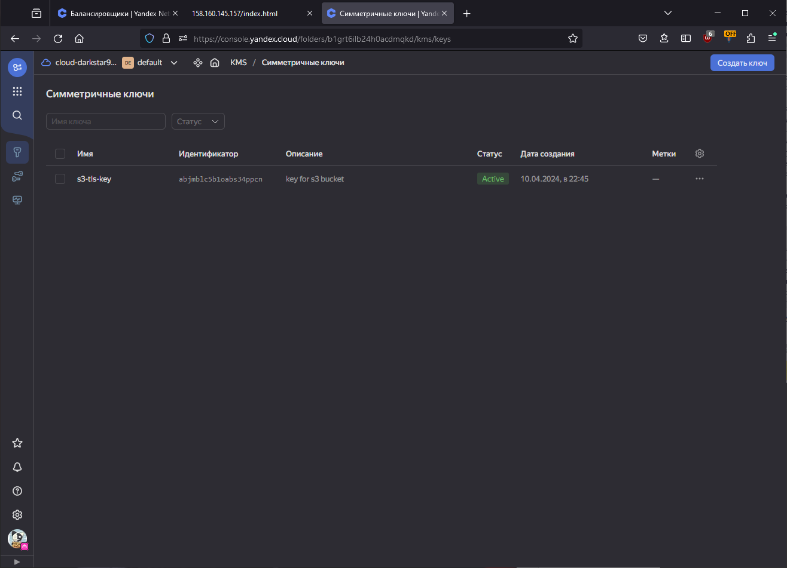
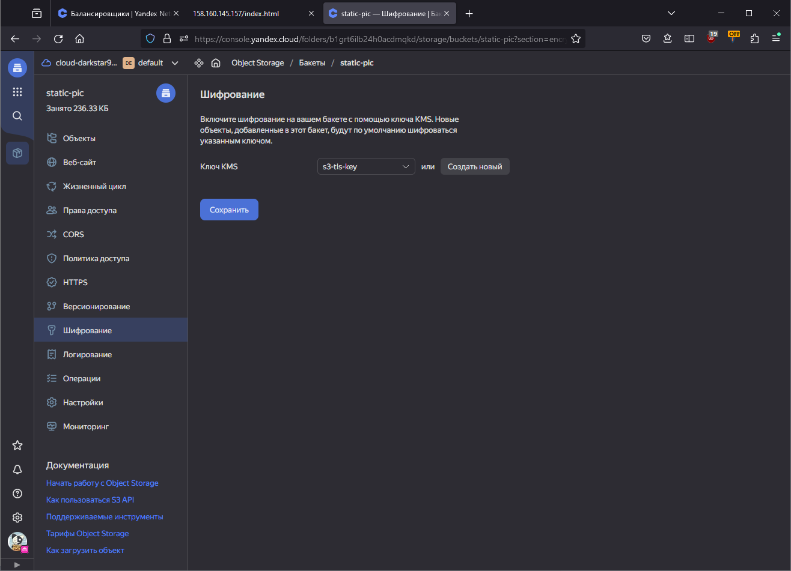
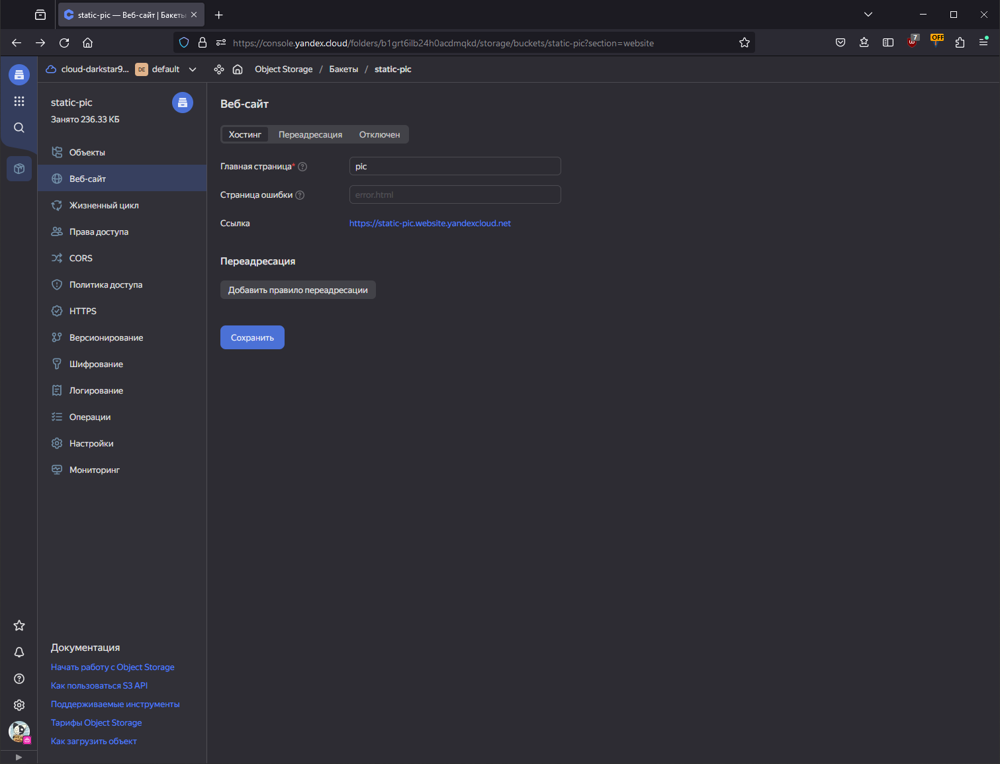
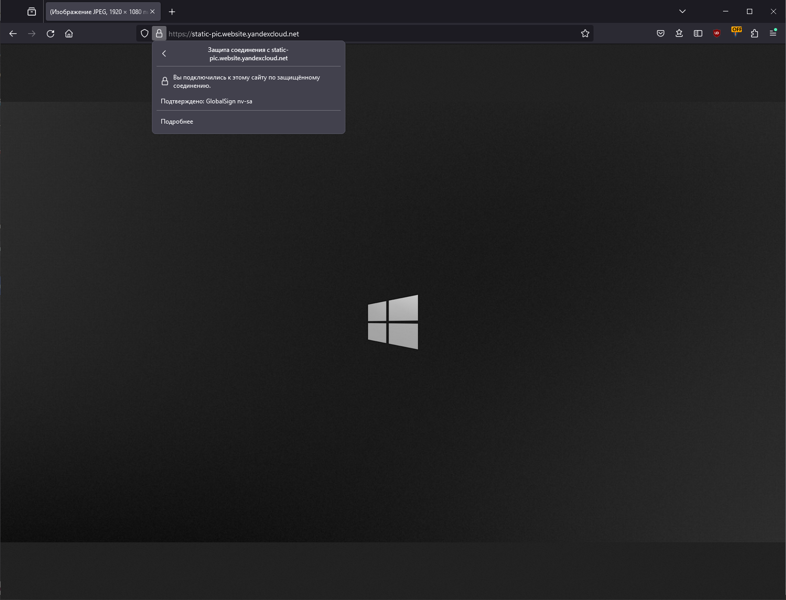

# Домашнее задание к занятию 15.3 "Безопасность в облачных провайдерах"

<details>
  <summary><b>Задание 1. Yandex Cloud</b></summary>

**Что нужно сделать**

1. С помощью ключа в KMS необходимо зашифровать содержимое бакета:

- Создать ключ в KMS,
- С помощью ключа зашифровать содержимое бакета, созданного ранее.

2. (Выполняется НЕ в terraform) *Создать статический сайт в Object Storage c собственным публичным адресом и сделать доступным по HTTPS

- Создать сертификат,
- Создать статическую страницу в Object Storage и применить сертификат HTTPS,
- В качестве результата предоставить скриншот на страницу с сертификатом в заголовке ("замочек").

</details>

## Ответ

### 1. С помощью ключа в KMS необходимо зашифровать содержимое бакета

<details>
  <summary>kms.tf</summary>

```terraform
resource "yandex_kms_symmetric_key" "s3-tls-key" {
  name              = "s3-tls-key"
  description       = "key for s3 bucket"
  default_algorithm = "AES_128"
  rotation_period   = "8760h" // equal to 1 year
}

resource "yandex_resourcemanager_folder_iam_member" "kms-user" {
  folder_id = var.folder_id
  role      = "kms.keys.encrypterDecrypter"
  member    = "serviceAccount:${yandex_iam_service_account.s3-bucket.id}"
  depends_on = [yandex_iam_service_account.s3-bucket]
}
```

</details>



<details>
  <summary>s3_bucket.tf</summary>

```terraform
resource "yandex_iam_service_account" "s3-bucket" {
    name      = "acc-bucket"
}

resource "yandex_resourcemanager_folder_iam_member" "s3-bucket-editor" {
  folder_id = "${var.folder_id}"
  role      = "storage.editor"
  member    = "serviceAccount:${yandex_iam_service_account.s3-bucket.id}"
}

resource "yandex_iam_service_account_static_access_key" "s3-bucket-key" {
  service_account_id = yandex_iam_service_account.s3-bucket.id
  description        = "access key for s3"
}

resource "yandex_storage_bucket" "static-pic" {
    access_key = yandex_iam_service_account_static_access_key.s3-bucket-key.access_key
    secret_key = yandex_iam_service_account_static_access_key.s3-bucket-key.secret_key
    bucket = "static-pic"
    acl    = "public-read"
    server_side_encryption_configuration {
        rule {
            apply_server_side_encryption_by_default {
                kms_master_key_id = yandex_kms_symmetric_key.s3-tls-key.id
                sse_algorithm     = "aws:kms"
            }
        }
    }
}

resource "yandex_storage_object" "pic" {
  access_key = yandex_iam_service_account_static_access_key.s3-bucket-key.access_key
  secret_key = yandex_iam_service_account_static_access_key.s3-bucket-key.secret_key
  bucket     = yandex_storage_bucket.static-pic.bucket
  key        = "pic"
  source     = "./pic_s3/winBlack.jpg"
}
```

</details>



### 2. (Выполняется НЕ в terraform) *Создать статический сайт в Object Storage c собственным публичным адресом и сделать доступным по HTTPS



