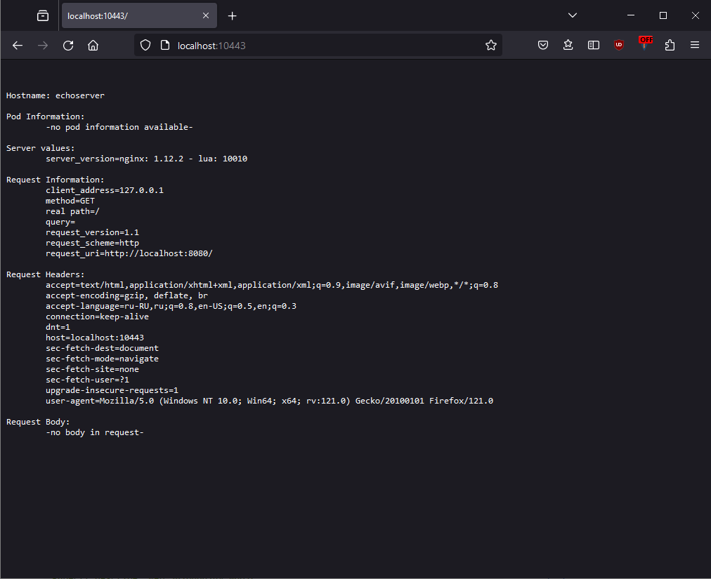

# Домашнее задание к занятию «Базовые объекты K8S»

<details>
  <summary><b>Задание 1. Создать Pod с именем hello-world</b></summary>

1. Создать манифест (yaml-конфигурацию) Pod.
2. Использовать image - gcr.io/kubernetes-e2e-test-images/echoserver:2.2.
3. Подключиться локально к Pod с помощью `kubectl port-forward` и вывести значение (curl или в браузере).

</details>

## Ответ

### 1. Создать манифест (yaml-конфигурацию) Pod.

### 2. Использовать image - gcr.io/kubernetes-e2e-test-images/echoserver:2.2.

```yaml
apiVersion: v1
kind: Pod
metadata:
  name: echoserver
spec:
  containers:
  - name: echoserver
    image: gcr.io/kubernetes-e2e-test-images/echoserver:2.2
    ports:
    - containerPort: 8080
```

### 3. Подключиться локально к Pod с помощью `kubectl port-forward` и вывести значение (curl или в браузере).

```bash
PS D:\VM_RDP\Vagrant_learn\for_ansible\kubes> .\kubectl port-forward pods/echoserver 10443:8080
Forwarding from 127.0.0.1:10443 -> 8080
Forwarding from [::1]:10443 -> 8080
Handling connection for 10443
```



<details>
  <summary><b>Задание 2. Создать Service и подключить его к Pod</b></summary>

1. Создать Pod с именем netology-web.
2. Использовать image — gcr.io/kubernetes-e2e-test-images/echoserver:2.2.
3. Создать Service с именем netology-svc и подключить к netology-web.
4. Подключиться локально к Service с помощью `kubectl port-forward` и вывести значение (curl или в браузере).

</details>

## Ответ

### 1. Создать Pod с именем netology-web.

### 2. Использовать image — gcr.io/kubernetes-e2e-test-images/echoserver:2.2.

```yaml
apiVersion: v1
kind: Pod
metadata:
  name: netology-web
  labels:
    name: netology-web
spec:
  containers:
  - name: netology-web
    image: gcr.io/kubernetes-e2e-test-images/echoserver:2.2
    ports:
    - containerPort: 8080
```

### 3. Создать Service с именем netology-svc и подключить к netology-web.

```yaml
apiVersion: v1
kind: Service
metadata:
  name: netology-svc
spec:
  selector:
    name: netology-web
  ports:
    - protocol: TCP
      port: 80
      targetPort: 8080
```

### 4. Подключиться локально к Service с помощью `kubectl port-forward` и вывести значение (curl или в браузере).

```bash
D:\VM_RDP\Vagrant_learn\for_ansible\kubes> .\kubectl port-forward svc/netology-svc 10443:80   
Forwarding from 127.0.0.1:10443 -> 8080
Forwarding from [::1]:10443 -> 8080
Handling connection for 10443
```

### Вывод `kubectl get pods`

```bash
D:\VM_RDP\Vagrant_learn\for_ansible\kubes> .\kubectl get pods
NAME           READY   STATUS    RESTARTS   AGE
echoserver     1/1     Running   0          32m
netology-web   1/1     Running   0          2m33s
```