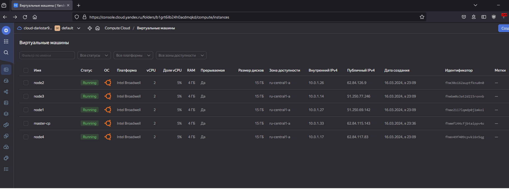

# Домашнее задание к занятию «Установка Kubernetes»

<details>
  <summary><b>Задание 1. Установить кластер k8s с 1 master node</b></summary>

1. Подготовка работы кластера из 5 нод: 1 мастер и 4 рабочие ноды.
2. В качестве CRI — containerd.
3. Запуск etcd производить на мастере.
4. Способ установки выбрать самостоятельно.


</details>

## Ответ

### 1. Подготовка работы кластера из 5 нод: 1 мастер и 4 рабочие ноды.



### 3. Запуск etcd производить на мастере.

```bash
ubuntu@node4:~/kubespray/inventory/mycluster$ cat hosts.yaml
all:
  hosts:
    node1:
      ansible_host: 10.0.1.26
      ip: 10.0.1.26
      access_ip: 10.0.1.26
    node2:
      ansible_host: 10.0.1.14
      ip: 10.0.1.14
      access_ip: 10.0.1.14
    node3:
      ansible_host: 10.0.1.27
      ip: 10.0.1.27
      access_ip: 10.0.1.27
    node4:
      ansible_host: 10.0.1.33
      ip: 10.0.1.33
      access_ip: 10.0.1.33
    node5:
      ansible_host: 10.0.1.17
      ip: 10.0.1.17
      access_ip: 10.0.1.17
  children:
    kube_control_plane:
      hosts:
        node4:
    kube_node:
      hosts:
        node1:
        node2:
        node3:
        node5:
    etcd:
      hosts:
        node4:
    k8s_cluster:
      children:
        kube_control_plane:
        kube_node:
    calico_rr:
      hosts: {}
```

### 4. Способ установки выбрать самостоятельно.

Использовал kubespray

```bash
(kubespray-venv) ubuntu@node4:~/kubespray$ ansible-playbook -i inventory/mycluster/hosts.yaml --become --become-user=root cluster.yml
[WARNING]: Skipping callback plugin 'ara_default', unable to load

PLAY [Check Ansible version] ********************************************************************************************************************
Saturday 16 March 2024  22:02:13 +0000 (0:00:00.037)       0:00:00.037 ********

TASK [Check 2.16.4 <= Ansible version < 2.17.0] *************************************************************************************************
ok: [node1] => {
    "changed": false,
    "msg": "All assertions passed"
}
Saturday 16 March 2024  22:02:13 +0000 (0:00:00.043)       0:00:00.080 ********

TASK [Check that python netaddr is installed] ***************************************************************************************************
ok: [node1] => {
    "changed": false,
    "msg": "All assertions passed"
}
Saturday 16 March 2024  22:02:13 +0000 (0:00:00.101)       0:00:00.181 ********

TASK [Check that jinja is not too old (install via pip)] ****************************************************************************************
ok: [node1] => {
    "changed": false,
    "msg": "All assertions passed"
}
...
Saturday 16 March 2024  22:22:28 +0000 (0:00:00.099)       0:20:15.405 ********

TASK [network_plugin/calico : Check if inventory match current cluster configuration] ***********************************************************
ok: [node4] => {
    "changed": false,
    "msg": "All assertions passed"
}
Saturday 16 March 2024  22:22:28 +0000 (0:00:00.110)       0:20:15.516 ********
Saturday 16 March 2024  22:22:28 +0000 (0:00:00.061)       0:20:15.577 ********
Saturday 16 March 2024  22:22:28 +0000 (0:00:00.059)       0:20:15.636 ********

PLAY RECAP **************************************************************************************************************************************
node1                      : ok=436  changed=51   unreachable=0    failed=0    skipped=687  rescued=0    ignored=1
node2                      : ok=433  changed=51   unreachable=0    failed=0    skipped=683  rescued=0    ignored=1
node3                      : ok=433  changed=51   unreachable=0    failed=0    skipped=683  rescued=0    ignored=1
node4                      : ok=687  changed=106  unreachable=0    failed=0    skipped=1162 rescued=0    ignored=6
node5                      : ok=433  changed=51   unreachable=0    failed=0    skipped=683  rescued=0    ignored=1

Saturday 16 March 2024  22:22:29 +0000 (0:00:00.336)       0:20:15.973 ********
===============================================================================
download : Download_file | Download item ------------------------------------------------------------------------------------------------ 81.07s
network_plugin/calico : Wait for calico kubeconfig to be created ------------------------------------------------------------------------ 43.42s
download : Download_file | Download item ------------------------------------------------------------------------------------------------ 38.44s
download : Download_file | Download item ------------------------------------------------------------------------------------------------ 38.01s
download : Download_file | Download item ------------------------------------------------------------------------------------------------ 31.98s
kubernetes/preinstall : Update package management cache (APT) --------------------------------------------------------------------------- 26.74s
container-engine/containerd : Containerd | Unpack containerd archive -------------------------------------------------------------------- 24.65s
container-engine/nerdctl : Download_file | Download item -------------------------------------------------------------------------------- 18.97s
container-engine/crictl : Download_file | Download item --------------------------------------------------------------------------------- 18.20s
container-engine/runc : Download_file | Download item ----------------------------------------------------------------------------------- 18.01s
container-engine/containerd : Download_file | Download item ----------------------------------------------------------------------------- 17.91s
download : Download_container | Download image if required ------------------------------------------------------------------------------ 17.28s
kubernetes/control-plane : Master | wait for kube-controller-manager -------------------------------------------------------------------- 16.60s
kubernetes/control-plane : Kubeadm | Initialize first master ---------------------------------------------------------------------------- 15.99s
kubernetes/kubeadm : Join to cluster ---------------------------------------------------------------------------------------------------- 15.64s
container-engine/crictl : Extract_file | Unpacking archive ------------------------------------------------------------------------------ 14.46s
container-engine/nerdctl : Extract_file | Unpacking archive ----------------------------------------------------------------------------- 13.50s
download : Download_container | Download image if required ------------------------------------------------------------------------------ 12.79s
bootstrap-os : Install dbus for the hostname module ------------------------------------------------------------------------------------- 11.26s
container-engine/crictl : Copy crictl binary from download dir -------------------------------------------------------------------------- 10.82s
ubuntu@node4:~/.kube$ sudo kubectl get nodes
NAME    STATUS   ROLES           AGE   VERSION
node1   Ready    <none>          21m   v1.29.2
node2   Ready    <none>          21m   v1.29.2
node3   Ready    <none>          21m   v1.29.2
node4   Ready    control-plane   22m   v1.29.2
node5   Ready    <none>          21m   v1.29.2
```